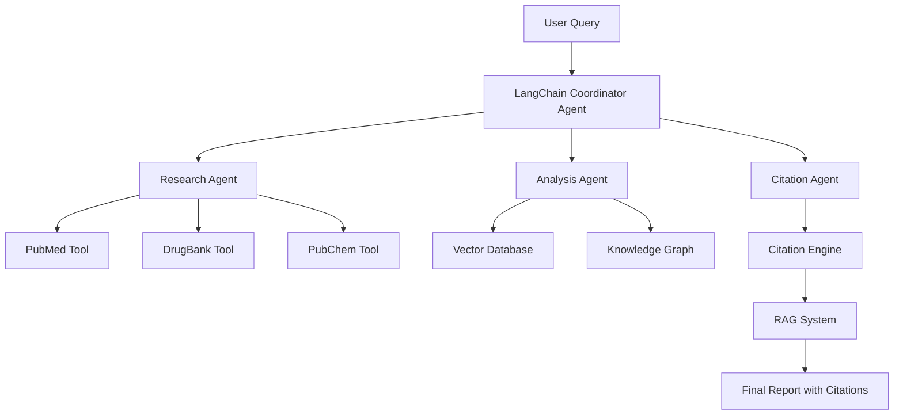

# Rare Disease Drug Repurposing AI System

[](https://opensource.org/licenses/MIT)
[](https://www.python.org/downloads/)
[](https://langchain.com/)

## 🚀 Vision

Accelerating drug repurposing for rare diseases through AI-powered biomedical knowledge discovery, leveraging LangChain's integration with Claude models and citable search results to build trustworthy, verifiable AI systems where hallucinations can be life-threatening.

## 📊 Impact Potential

- **Target Population**: ~300 million people worldwide affected by rare diseases
- **Current Treatment Gap**: <6% of rare diseases have approved treatments
- **Traditional Timeline**: 10-15 years for new drug development
- **Our Goal**: Reduce discovery timelines from years to weeks with cited evidence

## 🎯 Key Features

### 🔬 **AI-Powered Drug Discovery**
- Multi-agent system with specialized LLM agents for different research tasks
- Integration with 15+ biomedical databases (PubMed, DrugBank, PubChem, WHO, CDC)
- Retrieval-Augmented Generation (RAG) with mandatory citations for medical safety

### 🧬 **Rare Disease Focus**
- Specialized knowledge base for rare genetic disorders
- Patient symptom analysis and genetic data integration
- Drug interaction and safety profile analysis

### 📚 **Citable Evidence System**
- Every recommendation linked to peer-reviewed sources
- Real-time access to latest clinical trials and research
- Transparent AI reasoning with source attribution

### 🔧 **Extensible Architecture**
- Modular design for easy addition of new databases
- RESTful API for integration with existing healthcare systems
- Support for custom rare disease ontologies

## 🏗️ System Architecture



## 🚀 Quick Start

### Prerequisites
- Python 3.8+
- Docker & Docker Compose
- OpenAI API key or Claude API access
- 16GB+ RAM recommended

### Installation

```bash
# Clone the repository
git clone https://github.com/your-org/rare-disease-drug-repurposing-ai
cd rare-disease-drug-repurposing-ai

# Set up Python environment
python -m venv venv
source venv/bin/activate  # On Windows: venv\Scripts\activate

# Install dependencies
pip install -r config/requirements.txt

# Set up environment variables
cp .env.example .env
# Edit .env with your API keys

# Start the system
docker-compose up -d

# Run data ingestion
python scripts/data_ingestion.py

# Start the API server
python src/api/main.py
```

### Basic Usage

```python
from src.core.models import RareDiseaseDrugRepurposing

# Initialize the system
system = RareDiseaseDrugRepurposing()

# Query for drug repurposing opportunities
result = system.analyze_disease(
    disease_name="Hutchinson-Gilford Progeria Syndrome",
    symptoms=["accelerated aging", "cardiovascular complications"],
    genetic_markers=["LMNA mutations"]
)

# Access results with citations
print(result.recommendations)  # Drug candidates
print(result.evidence)         # Supporting research
print(result.citations)       # Source references
```

## 📋 Use Cases

### 1. **Drug Repurposing Discovery**
- Input: Rare disease symptoms and genetic data
- Output: Ranked list of existing drugs with repurposing potential
- Evidence: Peer-reviewed citations for each recommendation

### 2. **Clinical Trial Matching**
- Input: Patient profile and condition
- Output: Relevant ongoing clinical trials
- Evidence: Trial registry data and eligibility criteria

### 3. **Mechanism of Action Analysis**
- Input: Drug compound and target disease
- Output: Biological pathway analysis
- Evidence: Molecular interaction databases

### 4. **Safety Profile Assessment**
- Input: Drug candidate and patient characteristics
- Output: Risk assessment and contraindications
- Evidence: Adverse event databases and case studies

## 🔬 Core Components

### **Multi-Agent System**
- **Coordinator Agent**: Orchestrates research workflow
- **Research Agent**: Queries biomedical databases
- **Analysis Agent**: Processes molecular and clinical data
- **Citation Agent**: Ensures all outputs are properly sourced

### **Knowledge Integration**
- **Vector Database**: Semantic search across biomedical literature
- **Knowledge Graph**: Structured relationships between drugs, diseases, genes
- **Real-time APIs**: Live access to latest research and clinical data

### **Safety & Compliance**
- **Citation Mandatory**: Every recommendation includes source attribution
- **Confidence Scoring**: Quantified reliability for each suggestion
- **Regulatory Alignment**: Consideration of FDA and EMA guidelines

## 📊 Supported Databases

| Database | Coverage | API Access | Update Frequency |
|----------|----------|------------|------------------|
| PubMed | 35M+ citations | ✅ | Daily |
| DrugBank | 14K+ drugs | ✅ | Quarterly |
| PubChem | 110M+ compounds | ✅ | Daily |
| ClinicalTrials.gov | 400K+ trials | ✅ | Daily |
| OMIM | 25K+ genetic disorders | ✅ | Weekly |
| WHO Drug Information | Global drug data | ✅ | Monthly |
| FDA Adverse Events | Safety data | ✅ | Quarterly |

## 🛡️ Safety Features

### **Anti-Hallucination Measures**
- Mandatory source citations for all medical claims
- Confidence thresholds for recommendations
- Human-in-the-loop validation workflows

### **Medical Compliance**
- HIPAA-compliant data handling
- Regulatory-aware drug recommendations
- Clear disclaimers about clinical decision-making

### **Quality Assurance**
- Peer-reviewed source prioritization
- Recency weighting for medical literature
- Contradiction detection and flagging

## 🤝 Contributing

We welcome contributions from the biomedical AI community! Please see our [Contributing Guide](CONTRIBUTING.md) for details.

### Priority Areas
- Additional rare disease databases
- Improved citation accuracy
- Multi-language support
- Clinical workflow integration

## 📜 License

This project is licensed under the MIT License - see the [LICENSE](LICENSE) file for details.

## 🙏 Acknowledgments

- International Rare Diseases Research Consortium (IRDiRC)
- Global Alliance for Genomics and Health (GA4GH)
- OpenAI and Anthropic for LLM access
- The rare disease patient community for their invaluable insights

## 📞 Contact

- **Project Lead**: [Your Name](mailto:your.email@example.com)
- **Research Collaborations**: research@yourorg.com
- **Technical Support**: support@yourorg.com

## 🔗 Related Projects

- [LangChain](https://github.com/langchain-ai/langchain) - LLM application framework
- [BioLinkML](https://github.com/biolink/biolinkml) - Biomedical data modeling
- [OpenTargets](https://www.opentargets.org/) - Target-disease associations
- [Monarch Initiative](https://monarchinitiative.org/) - Rare disease phenotypes

---

**⚠️ Medical Disclaimer**: This system is for research purposes only and should not be used as a substitute for professional medical advice, diagnosis, or treatment. Always consult qualified healthcare professionals for medical decisions.