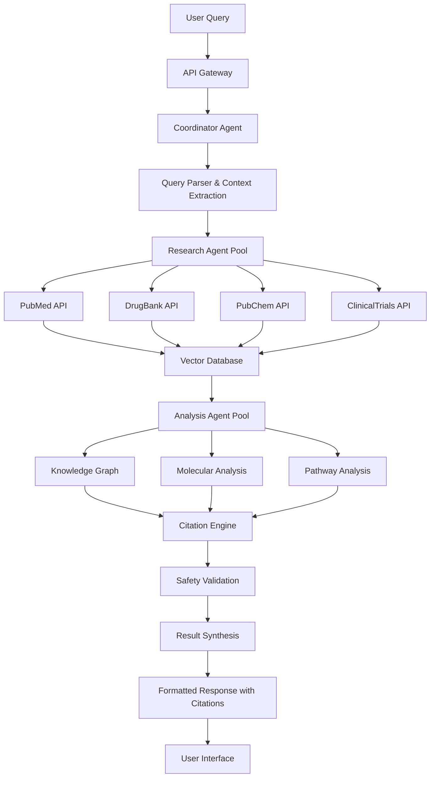

# System Architecture - Rare Disease Drug Repurposing AI

## 🏗️ High-Level Architecture

The Rare Disease Drug Repurposing AI System is built using a microservices architecture with LangChain orchestrating multiple specialized agents, each designed for specific biomedical research tasks.

## 🧠 Core Components

### 1. **LangChain Agent Orchestration Layer**

#### **Coordinator Agent (Primary Orchestrator)**
```python
class CoordinatorAgent:
    """
    Main orchestration agent that manages the entire drug repurposing workflow
    """
    responsibilities:
        - Parse user queries and medical contexts
        - Route tasks to appropriate specialized agents
        - Aggregate results from multiple agents
        - Ensure citation integrity across all responses
        - Manage agent-to-agent communication
    
    tools:
        - Task planning and decomposition
        - Agent state management
        - Result synthesis and ranking
        - Quality assurance checks
```

#### **Research Agent (Data Collection)**
```python
class ResearchAgent:
    """
    Specialized agent for biomedical literature and database research
    """
    responsibilities:
        - Query PubMed for relevant research papers
        - Access DrugBank for drug information
        - Retrieve molecular data from PubChem
        - Fetch clinical trial data
        - Collect WHO and FDA regulatory information
    
    tools:
        - PubMed API integration
        - DrugBank database connector
        - PubChem compound searcher
        - ClinicalTrials.gov API
        - Regulatory database interfaces
```

#### **Analysis Agent (Data Processing)**
```python
class AnalysisAgent:
    """
    Processes collected data for drug repurposing insights
    """
    responsibilities:
        - Molecular similarity analysis
        - Drug-target interaction prediction
        - Pathway analysis and mechanism elucidation
        - Safety profile assessment
        - Dosage and formulation considerations
    
    tools:
        - Molecular fingerprint analysis
        - Graph neural networks for drug-protein interactions
        - Biological pathway mapping
        - ADMET property prediction
        - Drug interaction checkers
```

#### **Citation Agent (Source Verification)**
```python
class CitationAgent:
    """
    Ensures all recommendations are properly cited and verifiable
    """
    responsibilities:
        - Validate source authenticity
        - Format citations according to medical standards
        - Track source reliability and recency
        - Flag potential conflicts or contradictions
        - Generate evidence summaries
    
    tools:
        - Citation formatting engine
        - Source verification algorithms
        - Conflict detection systems
        - Evidence quality scoring
        - Reference management
```

### 2. **Retrieval-Augmented Generation (RAG) System**

#### **Vector Database Architecture**
```yaml
Vector Store Configuration:
  Primary: Pinecone / Weaviate / Qdrant
  Embeddings: BioBERT / SciBERT / PubMedBERT
  Index Types:
    - Literature embeddings (35M+ PubMed abstracts)
    - Drug compound embeddings (110M+ PubChem compounds)
    - Disease phenotype embeddings (OMIM, HPO)
    - Clinical trial embeddings (400K+ trials)
  
  Retrieval Strategy:
    - Hybrid search (dense + sparse)
    - Semantic similarity matching
    - Metadata filtering by:
      - Publication date (recency bias)
      - Journal impact factor
      - Study type (RCT > observational > case study)
      - Evidence level (systematic review > meta-analysis > primary research)
```

#### **Knowledge Graph Integration**
```yaml
Graph Database: Neo4j / Amazon Neptune
Node Types:
  - Diseases (OMIM, Orphanet IDs)
  - Drugs (DrugBank IDs, ATC codes)
  - Genes (HGNC symbols, Entrez IDs)
  - Proteins (UniProt IDs)
  - Pathways (KEGG, Reactome IDs)
  - Clinical Trials (NCT numbers)
  - Publications (PubMed IDs, DOIs)

Relationship Types:
  - TREATS (drug -> disease)
  - CAUSES (gene -> disease)
  - TARGETS (drug -> protein)
  - PARTICIPATES_IN (gene -> pathway)
  - INTERACTS_WITH (drug -> drug)
  - PUBLISHED_IN (finding -> publication)
```

### 3. **Biomedical Tool Integration**

#### **Database Connectors**
```python
class BiomedicalTools:
    def __init__(self):
        self.pubmed = PubMedTool()
        self.drugbank = DrugBankTool()
        self.pubchem = PubChemTool()
        self.clinicaltrials = ClinicalTrialsTool()
        self.omim = OMIMTool()
        self.reactome = ReactomeTool()
        
    async def parallel_search(self, query: str) -> List[SearchResult]:
        """Execute searches across multiple databases in parallel"""
        tasks = [
            self.pubmed.search(query),
            self.drugbank.search(query),
            self.pubchem.search(query),
            self.clinicaltrials.search(query)
        ]
        return await asyncio.gather(*tasks)
```

#### **API Rate Limiting & Caching**
```python
class APIManager:
    """
    Manages API rate limits and implements intelligent caching
    """
    rate_limits = {
        'pubmed': {'requests_per_second': 10, 'burst': 100},
        'drugbank': {'requests_per_minute': 1000},
        'pubchem': {'requests_per_second': 5},
        'clinicaltrials': {'requests_per_second': 20}
    }
    
    cache_strategy = {
        'ttl': 86400,  # 24 hours for most queries
        'medical_emergency_ttl': 3600,  # 1 hour for urgent queries
        'research_ttl': 604800  # 1 week for research queries
    }
```

### 4. **Citation Engine Architecture**

#### **Source Verification Pipeline**
```python
class CitationEngine:
    def __init__(self):
        self.verifiers = [
            DOIVerifier(),
            PubMedValidator(),
            ImpactFactorChecker(),
            RetractionWatcher(),
            RecencyScorer()
        ]
    
    def validate_citation(self, citation: Citation) -> ValidationResult:
        """
        Multi-step validation process for medical citations
        """
        scores = []
        for verifier in self.verifiers:
            score = verifier.validate(citation)
            scores.append(score)
        
        return ValidationResult(
            is_valid=all(s.is_valid for s in scores),
            confidence=np.mean([s.confidence for s in scores]),
            flags=[s.flags for s in scores if s.flags]
        )
```

#### **Citation Format Standards**
```yaml
Citation Formats:
  Primary: Vancouver (for medical literature)
  Secondary: APA (for general scientific literature)
  
Required Fields:
  - Authors (with ORCID when available)
  - Title
  - Journal/Source
  - Publication date
  - DOI/PubMed ID
  - Access date (for web sources)
  - Evidence level classification
  
Quality Indicators:
  - Journal impact factor
  - Citation count
  - Study methodology quality
  - Peer review status
  - Potential conflicts of interest
```

### 5. **Safety & Compliance Framework**

#### **Medical Safety Guardrails**
```python
class MedicalSafetyGuards:
    def __init__(self):
        self.contraindication_checker = ContraindicationChecker()
        self.interaction_analyzer = DrugInteractionAnalyzer()
        self.dosage_validator = DosageValidator()
        self.allergy_checker = AllergyChecker()
    
    def validate_recommendation(self, drug: Drug, patient_profile: PatientProfile) -> SafetyAssessment:
        """
        Comprehensive safety check before making any drug recommendations
        """
        checks = [
            self.contraindication_checker.check(drug, patient_profile),
            self.interaction_analyzer.analyze(drug, patient_profile.current_medications),
            self.dosage_validator.validate(drug, patient_profile),
            self.allergy_checker.check(drug, patient_profile.allergies)
        ]
        
        return SafetyAssessment(
            is_safe=all(check.is_safe for check in checks),
            warnings=[check.warnings for check in checks if check.warnings],
            contraindications=[check.contraindications for check in checks if check.contraindications]
        )
```

#### **Regulatory Compliance**
```yaml
Compliance Standards:
  - HIPAA (Health Insurance Portability and Accountability Act)
  - FDA 21 CFR Part 11 (Electronic Records)
  - GDPR (General Data Protection Regulation)
  - ICH E6 (Good Clinical Practice)
  
Data Handling:
  - PHI encryption at rest and in transit
  - Access logging and audit trails
  - Data retention policies
  - Right to deletion (GDPR Article 17)
  
Medical Disclaimers:
  - Clear indication of research/informational purpose
  - Recommendation to consult healthcare professionals
  - Limitations of AI-generated recommendations
  - Citation of regulatory approval status
```

## 🚀 Deployment Architecture

### **Containerized Microservices**
```yaml
Services:
  coordinator-agent:
    image: rare-disease-ai/coordinator:latest
    resources:
      cpu: 2 cores
      memory: 4GB
    replicas: 3
    
  research-agent:
    image: rare-disease-ai/research:latest
    resources:
      cpu: 4 cores
      memory: 8GB
    replicas: 5
    
  analysis-agent:
    image: rare-disease-ai/analysis:latest
    resources:
      cpu: 8 cores
      memory: 16GB
      gpu: 1 (for molecular modeling)
    replicas: 2
    
  citation-engine:
    image: rare-disease-ai/citation:latest
    resources:
      cpu: 2 cores
      memory: 4GB
    replicas: 3
    
  vector-database:
    image: qdrant/qdrant:latest
    resources:
      cpu: 4 cores
      memory: 32GB
      storage: 500GB SSD
    replicas: 3 (with clustering)
    
  knowledge-graph:
    image: neo4j:latest
    resources:
      cpu: 4 cores
      memory: 16GB
      storage: 200GB SSD
    replicas: 1 (with backup)
```

### **Scalability & Performance**
```yaml
Load Balancing:
  - API Gateway: Kong/Istio
  - Auto-scaling based on CPU/memory usage
  - Geographic distribution for global access
  
Caching Strategy:
  - Redis for session management
  - CDN for static content
  - Database query result caching
  
Monitoring:
  - Prometheus for metrics collection
  - Grafana for visualization
  - ELK stack for log analysis
  - Custom medical AI metrics
```

### **Data Flow Architecture**



## 🔧 Technical Implementation Details

### **LangChain Integration**
```python
from langchain.agents import AgentExecutor, create_openai_tools_agent
from langchain.tools import Tool
from langchain.prompts import ChatPromptTemplate
from langchain.schema import AgentAction, AgentFinish

class RareDiseaseRepurposingChain:
    def __init__(self):
        self.coordinator = CoordinatorAgent()
        self.tools = [
            self.create_pubmed_tool(),
            self.create_drugbank_tool(),
            self.create_analysis_tool(),
            self.create_citation_tool()
        ]
        
        self.prompt = ChatPromptTemplate.from_messages([
            ("system", """You are a specialized AI assistant for rare disease drug repurposing.
            Your goal is to find existing FDA-approved drugs that could be repurposed 
            for treating rare diseases. ALWAYS cite your sources and include confidence scores.
            
            Available tools: {tools}
            
            For every recommendation, you MUST:
            1. Provide at least 3 peer-reviewed citations
            2. Include mechanism of action explanation
            3. List potential side effects and contraindications
            4. Suggest clinical trial design if applicable
            5. Rate confidence level (1-10) with justification
            """),
            ("human", "{input}"),
            ("assistant", "{agent_scratchpad}")
        ])
        
        self.agent = create_openai_tools_agent(
            llm=self.get_llm(),
            tools=self.tools,
            prompt=self.prompt
        )
        
        self.executor = AgentExecutor(
            agent=self.agent,
            tools=self.tools,
            verbose=True,
            max_iterations=10,
            return_intermediate_steps=True
        )
```

### **Database Schema Design**

#### **Vector Database Schema**
```python
@dataclass
class BiomedicalDocument:
    id: str
    content: str
    embedding: List[float]
    metadata: Dict[str, Any]
    
    # Medical-specific metadata
    publication_date: datetime
    journal_impact_factor: float
    study_type: str  # RCT, observational, case_study, etc.
    evidence_level: int  # 1 (highest) to 5 (lowest)
    mesh_terms: List[str]
    doi: str
    pubmed_id: Optional[str]
    
    # Drug-specific metadata (for drug documents)
    drugbank_id: Optional[str]
    atc_code: Optional[str]
    indication: Optional[str]
    mechanism_of_action: Optional[str]
    
    # Disease-specific metadata
    omim_id: Optional[str]
    orphanet_id: Optional[str]
    disease_category: Optional[str]
    prevalence: Optional[str]
```

#### **Knowledge Graph Schema**
```cypher
// Nodes
CREATE CONSTRAINT disease_id IF NOT EXISTS FOR (d:Disease) REQUIRE d.id IS UNIQUE;
CREATE CONSTRAINT drug_id IF NOT EXISTS FOR (dr:Drug) REQUIRE dr.id IS UNIQUE;
CREATE CONSTRAINT gene_id IF NOT EXISTS FOR (g:Gene) REQUIRE g.id IS UNIQUE;
CREATE CONSTRAINT protein_id IF NOT EXISTS FOR (p:Protein) REQUIRE p.id IS UNIQUE;

// Example relationships with properties
CREATE (d:Disease {id: 'OMIM:176670', name: 'Hutchinson-Gilford Progeria Syndrome'})
CREATE (dr:Drug {id: 'DB00227', name: 'Lovastatin', approval_status: 'approved'})
CREATE (g:Gene {id: 'LMNA', name: 'Lamin A/C'})

CREATE (dr)-[:POTENTIALLY_TREATS {confidence: 0.75, evidence_count: 15}]->(d)
CREATE (g)-[:CAUSES {penetrance: 0.95}]->(d)
CREATE (dr)-[:TARGETS {mechanism: 'HMG-CoA reductase inhibition'}]->(p:Protein {id: 'HMGCR'})
```

This architecture provides a robust, scalable, and medically-compliant foundation for the rare disease drug repurposing AI system, with strong emphasis on citation integrity and safety validation.