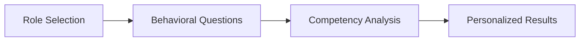

<div align="center">

# AI Competency Assessment Survey 🚀

**A modern, interactive tool to assess and improve AI skills across different professional roles**

[](https://opensource.org/licenses/MIT)
[](https://www.python.org/downloads/)
[](https://github.com/yourusername/ai-competency-assessment/issues)
[](https://github.com/yourusername/ai-competency-assessment/pulls)

[Live Demo](https://yourusername.github.io/ai-competency-assessment) • [Report Bug](https://github.com/yourusername/ai-competency-assessment/issues) • [Request Feature](https://github.com/yourusername/ai-competency-assessment/issues)

</div>

---

## 📋 Table of Contents

- [About The Project](#about-the-project)
- [Built With](#built-with)
- [Getting Started](#getting-started)
  - [Prerequisites](#prerequisites)
  - [Installation](#installation)
- [Usage](#usage)
- [How It Works](#how-it-works)
- [Customization](#customization)
- [Roadmap](#roadmap)
- [Contributing](#contributing)
- [License](#license)
- [Contact](#contact)
- [Acknowledgments](#acknowledgments)

## About The Project

<div align="center">
  
</div>

The AI Competency Assessment Survey is a comprehensive tool designed to help professionals evaluate their AI skills and identify growth opportunities. Based on industry best practices and inspired by leading tech companies' assessment frameworks, this tool provides:

- **Objective Assessment**: Behavioral questions that measure actual AI usage and impact
- **Role-Specific Evaluation**: Tailored assessments for Engineering, Product, Support, HR, and Marketing roles
- **Actionable Insights**: Personalized recommendations based on your competency level
- **Modern Experience**: Clean, accessible interface that works on all devices

### ✨ Key Features

<table>
<tr>
<td>

**🎨 Modern Design**
- Gradient-based UI
- Smooth animations
- Dark mode support (coming soon)

</td>
<td>

**📊 Smart Assessment**
- Role-specific questions
- Behavioral evaluation
- Objective scoring

</td>
<td>

**🚀 User Experience**
- Auto-advancing questions
- Progress tracking
- Instant results

</td>
</tr>
<tr>
<td>

**♿ Accessibility**
- WCAG 2.1 AA compliant
- Keyboard navigation
- Screen reader support

</td>
<td>

**📱 Responsive**
- Mobile-first design
- Touch-friendly
- All device support

</td>
<td>

**🔒 Privacy**
- No data collection
- Local processing
- Anonymous usage

</td>
</tr>
</table>

## Built With

This project is built with simplicity and performance in mind:

- **Frontend**: Vanilla JavaScript (ES6+)
- **Styling**: Pure CSS3 with CSS Variables
- **Server**: Python 3 HTTP Server
- **Fonts**: [Inter](https://fonts.google.com/specimen/Inter) by Google Fonts
- **Icons**: Unicode Emojis for cross-platform compatibility

## Getting Started

Get a local copy up and running in under 2 minutes.

### Prerequisites

- Python 3.6 or higher
- A modern web browser (Chrome, Firefox, Safari, Edge)
- Git (for cloning the repository)

### Installation

#### Option 1: Quick Start (Recommended)

```bash
# Clone the repository
git clone https://github.com/yourusername/ai-competency-assessment.git
cd ai-competency-assessment

# Launch with the provided script
./run.sh
```

#### Option 2: Manual Setup

```bash
# Clone the repository
git clone https://github.com/yourusername/ai-competency-assessment.git
cd ai-competency-assessment

# Start the server
python3 -m http.server 8000

# Open http://localhost:8000 in your browser
```

#### Option 3: Using Docker (Coming Soon)

```bash
# Build and run with Docker
docker build -t ai-competency .
docker run -p 8000:8000 ai-competency
```

## Usage

### Taking the Assessment

1. **Launch the application** using one of the installation methods above
2. **Select your role** from the available options
3. **Answer 5 questions** about your AI usage and experience
4. **View your results** with personalized recommendations
5. **Share or retake** the assessment as needed

### Understanding Your Results

Your competency level will be one of:

- **🟡 Foundational (0-25%)**: Just starting your AI journey
- **🟠 Developing (26-50%)**: Building AI skills and experience
- **🟢 Proficient (51-75%)**: Advanced AI integration in daily work
- **🔵 Advanced (76-100%)**: Leading AI innovation and transformation

## How It Works

### 1. Role Selection
Choose from 5 professional roles:
- **💻 Engineering**: Development & Technical
- **🚀 Product**: Strategy & Innovation
- **🎧 Support**: Customer Experience
- **👥 People/HR**: Human Resources
- **📈 Marketing**: Growth & Engagement

### 2. Assessment Questions
Answer 5 role-specific behavioral questions:
- Questions focus on frequency, integration, and impact of AI usage
- Neutral language without bias toward any competency level
- Auto-advance to next question after selection
- Back navigation available to review/change answers

### 3. Results & Insights
Receive your competency level with personalized recommendations:
- **Foundational** (0-25%): Basic awareness, limited experience
- **Developing** (26-50%): Regular basic usage, growing skills
- **Proficient** (51-75%): Advanced integration, measurable impact
- **Advanced** (76-100%): Expert level, driving innovation

### Architecture

The assessment follows a three-step process:



### Project Structure

```
ai-competency-assessment/
├── index.html              # Main HTML structure
├── styles.css              # Modern styling with animations
├── script.js               # Survey logic and interactions
├── run.sh                  # Launch script
├── README.md               # This file
├── surveydesign.md         # Design documentation
└── ai_competency_gradation.md  # Competency matrix source
```

### Code Quality

- **No Dependencies**: Pure vanilla implementation for maximum performance
- **Modular Design**: Separated concerns for easy maintenance
- **Modern JavaScript**: ES6+ features with fallbacks
- **CSS Variables**: Easy theming and customization
- **Semantic HTML**: Proper structure for accessibility

### Assessment Methodology

Our assessment methodology is based on:

1. **Behavioral Indicators**: Questions focus on what you do, not what you know
2. **Progressive Complexity**: Each answer option represents increasing AI sophistication
3. **Role Relevance**: Questions tailored to actual job responsibilities
4. **Objective Scoring**: No bias in question wording, clear scoring criteria

## Customization

### Adding New Roles
Edit `script.js` and add to the `roleQuestions` object:
```javascript
'NewRole': [
    {
        id: 'question_id',
        question: 'Your question here?',
        options: [
            { text: 'Option 1', score: 0 },
            { text: 'Option 2', score: 1 },
            // ... more options
        ]
    },
    // ... more questions
]
```

### Modifying Competency Levels
Edit the `competencyLevels` object in `script.js` to adjust:
- Score ranges
- Level names
- Descriptions
- Recommendations

### Styling Changes
Modify `styles.css` to customize:
- Colors: Update gradient colors and accent colors
- Fonts: Change font family or sizes
- Animations: Adjust transition timings
- Layout: Modify spacing and component sizes

## Roadmap

See the [open issues](https://github.com/yourusername/ai-competency-assessment/issues) for a list of proposed features and known issues.

### Upcoming Features

- [ ] Dark mode support
- [ ] Multi-language support (i18n)
- [ ] Export results as PDF
- [ ] Team/organization dashboards
- [ ] API for integration with HR systems
- [ ] Progressive Web App (PWA) support
- [ ] Advanced analytics and insights

## Contributing

Contributions are what make the open source community an amazing place to learn, inspire, and create. Any contributions you make are **greatly appreciated**.

### How to Contribute

1. Fork the Project
2. Create your Feature Branch (`git checkout -b feature/AmazingFeature`)
3. Commit your Changes (`git commit -m 'Add some AmazingFeature'`)
4. Push to the Branch (`git push origin feature/AmazingFeature`)
5. Open a Pull Request

### Development Guidelines

- Write clean, readable code with comments
- Follow the existing code style
- Test across different browsers and devices
- Ensure accessibility standards are maintained
- Update documentation as needed

For detailed guidelines, see [CONTRIBUTING.md](CONTRIBUTING.md) (coming soon).

## License

Distributed under the MIT License. See `LICENSE` for more information.

## Contact

Project Link: [https://github.com/yourusername/ai-competency-assessment](https://github.com/yourusername/ai-competency-assessment)

### Get Support

- 📫 **Email**: your.email@example.com
- 🐦 **Twitter**: [@yourhandle](https://twitter.com/yourhandle)
- 💬 **Discord**: [Join our community](https://discord.gg/yourinvite)
- 📖 **Documentation**: [Wiki](https://github.com/yourusername/ai-competency-assessment/wiki)

## Acknowledgments

- [Zapier](https://zapier.com) for their AI fluency measurement framework
- Silicon Valley tech companies for assessment best practices
- The open source community for continuous inspiration
- [Inter Font](https://rsms.me/inter/) by Rasmus Andersson
- [Shields.io](https://shields.io) for the beautiful badges

---

<div align="center">

**Made with ❤️ by the open source community**

[⬆ Back to top](#ai-competency-assessment-survey-)

</div>