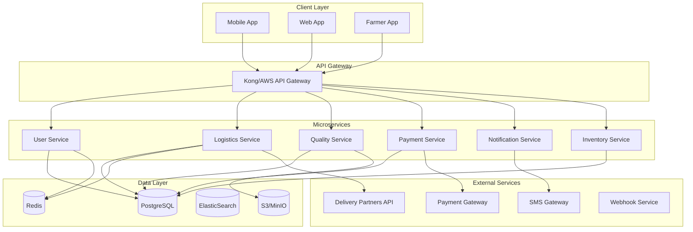

# Phase 2: Technical Design Specifications
## Supply Chain Optimization & Trust Building

### System Architecture Overview



---

## 1. Farmer Verification System

### API Endpoints

#### 1.1 KYC Verification
```typescript
POST /api/v2/farmers/kyc
Authorization: Bearer {token}
Content-Type: multipart/form-data

Request:
{
  "aadhaar_number": "XXXX-XXXX-XXXX",
  "pan_number": "ABCDE1234F",
  "aadhaar_front": File,
  "aadhaar_back": File,
  "pan_card": File,
  "selfie": File,
  "consent": true
}

Response:
{
  "verification_id": "VER123456",
  "status": "pending|verified|rejected",
  "aadhaar_verified": boolean,
  "pan_verified": boolean,
  "face_match_score": 0.95,
  "verification_timestamp": "2024-01-15T10:30:00Z",
  "next_steps": ["upload_farm_documents"]
}
```

#### 1.2 Farm Location Verification
```typescript
POST /api/v2/farmers/farm-verification
Authorization: Bearer {token}

Request:
{
  "farmer_id": "FARM123",
  "coordinates": {
    "latitude": 18.5204,
    "longitude": 73.8567
  },
  "land_documents": [File],
  "farm_photos": [File],
  "land_area_acres": 5.5,
  "soil_type": "black|red|alluvial",
  "water_source": "borewell|canal|rainwater",
  "crops": ["tomato", "onion", "potato"]
}

Response:
{
  "farm_id": "FRM456789",
  "verification_status": "verified",
  "land_ownership_verified": true,
  "location_verified": true,
  "eligible_for_organic": boolean,
  "farm_score": 85,
  "certifications_available": ["organic", "gap", "rainforest"]
}
```

### Database Schema

```sql
-- Farmer Verification Table
CREATE TABLE farmer_verifications (
    id UUID PRIMARY KEY DEFAULT gen_random_uuid(),
    farmer_id UUID REFERENCES farmers(id),
    aadhaar_number_hash VARCHAR(256),
    pan_number_hash VARCHAR(256),
    aadhaar_verified BOOLEAN DEFAULT FALSE,
    pan_verified BOOLEAN DEFAULT FALSE,
    face_match_score DECIMAL(3,2),
    verification_status ENUM('pending', 'verified', 'rejected', 'expired'),
    verified_at TIMESTAMP,
    verified_by UUID REFERENCES admins(id),
    rejection_reason TEXT,
    documents JSONB,
    created_at TIMESTAMP DEFAULT CURRENT_TIMESTAMP,
    updated_at TIMESTAMP DEFAULT CURRENT_TIMESTAMP
);

-- Farm Details Table
CREATE TABLE farm_details (
    id UUID PRIMARY KEY DEFAULT gen_random_uuid(),
    farmer_id UUID REFERENCES farmers(id),
    farm_name VARCHAR(255),
    location GEOGRAPHY(POINT, 4326),
    address TEXT,
    district VARCHAR(100),
    state VARCHAR(100),
    pincode VARCHAR(10),
    land_area_acres DECIMAL(10,2),
    soil_type VARCHAR(50),
    water_source VARCHAR(100),
    crops TEXT[],
    organic_certified BOOLEAN DEFAULT FALSE,
    certification_number VARCHAR(100),
    certification_expiry DATE,
    farm_images TEXT[],
    created_at TIMESTAMP DEFAULT CURRENT_TIMESTAMP
);

-- Farmer Ratings Table
CREATE TABLE farmer_ratings (
    id UUID PRIMARY KEY DEFAULT gen_random_uuid(),
    farmer_id UUID REFERENCES farmers(id),
    order_id UUID REFERENCES orders(id),
    consumer_id UUID REFERENCES users(id),
    rating INTEGER CHECK (rating >= 1 AND rating <= 5),
    quality_rating INTEGER CHECK (quality_rating >= 1 AND quality_rating <= 5),
    delivery_rating INTEGER CHECK (delivery_rating >= 1 AND delivery_rating <= 5),
    packaging_rating INTEGER CHECK (packaging_rating >= 1 AND packaging_rating <= 5),
    review_text TEXT,
    review_images TEXT[],
    is_verified_purchase BOOLEAN DEFAULT TRUE,
    created_at TIMESTAMP DEFAULT CURRENT_TIMESTAMP
);

CREATE INDEX idx_farmer_ratings_farmer_id ON farmer_ratings(farmer_id);
CREATE INDEX idx_farm_location ON farm_details USING GIST(location);
```

---

## 2. Smart Logistics Hub

### 2.1 Delivery Partner Integration

```typescript
// Delivery Partner Service Interface
interface DeliveryPartnerService {
  createPickup(request: PickupRequest): Promise<PickupResponse>;
  trackShipment(trackingId: string): Promise<TrackingInfo>;
  cancelPickup(pickupId: string): Promise<CancelResponse>;
  estimateDelivery(request: DeliveryEstimate): Promise<EstimateResponse>;
}

// Dunzo Integration
class DunzoService implements DeliveryPartnerService {
  private apiKey: string;
  private baseUrl = 'https://api.dunzo.com/v1';
  
  async createPickup(request: PickupRequest): Promise<PickupResponse> {
    const payload = {
      pickup_details: {
        lat: request.pickup.latitude,
        lng: request.pickup.longitude,
        address: request.pickup.address,
        contact: request.pickup.contact
      },
      drop_details: {
        lat: request.delivery.latitude,
        lng: request.delivery.longitude,
        address: request.delivery.address,
        contact: request.delivery.contact
      },
      package_details: {
        weight: request.weight_kg,
        dimensions: request.dimensions,
        category: request.category,
        is_fragile: request.is_perishable
      },
      payment_method: 'PREPAID'
    };
    
    const response = await axios.post(
      `${this.baseUrl}/orders`,
      payload,
      { headers: { 'Authorization': `Bearer ${this.apiKey}` }}
    );
    
    return {
      pickup_id: response.data.order_id,
      tracking_id: response.data.tracking_id,
      estimated_pickup: response.data.estimated_pickup_time,
      estimated_delivery: response.data.estimated_delivery_time,
      delivery_charge: response.data.delivery_fee
    };
  }
}
```

### 2.2 Route Optimization Algorithm

```python
# Route Optimization Service
from ortools.constraint_solver import routing_enums_pb2
from ortools.constraint_solver import pywrapcp
import numpy as np

class RouteOptimizer:
    def __init__(self, depot_location):
        self.depot = depot_location
        
    def optimize_route(self, delivery_points, vehicle_capacity=100):
        """
        Optimize delivery route using Google OR-Tools
        """
        # Distance matrix calculation
        locations = [self.depot] + delivery_points
        distance_matrix = self._calculate_distance_matrix(locations)
        
        # Create routing model
        manager = pywrapcp.RoutingIndexManager(
            len(locations), 1, 0
        )
        routing = pywrapcp.RoutingModel(manager)
        
        # Distance callback
        def distance_callback(from_index, to_index):
            from_node = manager.IndexToNode(from_index)
            to_node = manager.IndexToNode(to_index)
            return distance_matrix[from_node][to_node]
        
        transit_callback_index = routing.RegisterTransitCallback(distance_callback)
        routing.SetArcCostEvaluatorOfAllVehicles(transit_callback_index)
        
        # Capacity constraint
        demand_callback_index = routing.RegisterUnaryTransitCallback(
            lambda node: delivery_points[node-1].weight if node > 0 else 0
        )
        routing.AddDimensionWithVehicleCapacity(
            demand_callback_index,
            0,  # null capacity slack
            [vehicle_capacity],  # vehicle maximum capacities
            True,  # start cumul to zero
            'Capacity'
        )
        
        # Time windows
        time_callback_index = routing.RegisterTransitCallback(
            lambda from_index, to_index: self._time_callback(from_index, to_index)
        )
        routing.AddDimension(
            time_callback_index,
            30,  # allow waiting time
            480,  # maximum time per vehicle (8 hours)
            False,
            'Time'
        )
        
        # Solve
        search_parameters = pywrapcp.DefaultRoutingSearchParameters()
        search_parameters.first_solution_strategy = (
            routing_enums_pb2.FirstSolutionStrategy.PATH_CHEAPEST_ARC
        )
        
        solution = routing.SolveWithParameters(search_parameters)
        
        if solution:
            return self._extract_solution(manager, routing, solution)
        return None
    
    def _calculate_distance_matrix(self, locations):
        """Calculate distance matrix using Haversine formula"""
        n = len(locations)
        matrix = np.zeros((n, n))
        
        for i in range(n):
            for j in range(n):
                if i != j:
                    matrix[i][j] = self._haversine_distance(
                        locations[i], locations[j]
                    )
        return matrix
    
    def _haversine_distance(self, loc1, loc2):
        """Calculate distance between two GPS coordinates"""
        R = 6371  # Earth radius in km
        
        lat1, lon1 = np.radians(loc1)
        lat2, lon2 = np.radians(loc2)
        
        dlat = lat2 - lat1
        dlon = lon2 - lon1
        
        a = np.sin(dlat/2)**2 + np.cos(lat1) * np.cos(lat2) * np.sin(dlon/2)**2
        c = 2 * np.arcsin(np.sqrt(a))
        
        return R * c
```

### 2.3 Real-time Tracking System

```typescript
// WebSocket Service for Real-time Tracking
import { Server } from 'socket.io';
import Redis from 'ioredis';

class TrackingService {
  private io: Server;
  private redis: Redis;
  private trackingData: Map<string, TrackingInfo> = new Map();
  
  constructor(server: HttpServer) {
    this.io = new Server(server, {
      cors: { origin: '*' }
    });
    this.redis = new Redis();
    this.initializeHandlers();
  }
  
  private initializeHandlers() {
    this.io.on('connection', (socket) => {
      console.log(`Client connected: ${socket.id}`);
      
      // Join tracking room
      socket.on('track_order', async (orderId: string) => {
        socket.join(`order_${orderId}`);
        const trackingInfo = await this.getTrackingInfo(orderId);
        socket.emit('tracking_update', trackingInfo);
      });
      
      // Driver location update
      socket.on('driver_location', async (data: DriverLocation) => {
        await this.updateDriverLocation(data);
        this.io.to(`order_${data.orderId}`).emit('location_update', {
          latitude: data.latitude,
          longitude: data.longitude,
          timestamp: new Date().toISOString()
        });
      });
      
      socket.on('disconnect', () => {
        console.log(`Client disconnected: ${socket.id}`);
      });
    });
  }
  
  async updateDriverLocation(location: DriverLocation) {
    const key = `driver:${location.driverId}:location`;
    await this.redis.setex(
      key,
      300, // TTL 5 minutes
      JSON.stringify({
        orderId: location.orderId,
        latitude: location.latitude,
        longitude: location.longitude,
        speed: location.speed,
        heading: location.heading,
        timestamp: Date.now()
      })
    );
    
    // Update ETA
    const eta = await this.calculateETA(location);
    await this.redis.setex(
      `order:${location.orderId}:eta`,
      60,
      eta.toString()
    );
  }
  
  private async calculateETA(location: DriverLocation): Promise<number> {
    // Get delivery location
    const order = await this.getOrder(location.orderId);
    const distance = this.calculateDistance(
      location,
      order.deliveryLocation
    );
    
    // Assume average speed of 30 km/h in city
    const avgSpeed = location.speed || 30;
    const etaMinutes = (distance / avgSpeed) * 60;
    
    return Math.ceil(etaMinutes);
  }
}
```

---

## 3. Quality Assurance System

### 3.1 AI-Powered Quality Check

```python
# Quality Check ML Model
import tensorflow as tf
from tensorflow.keras import layers, models
import numpy as np
from PIL import Image

class QualityCheckModel:
    def __init__(self, model_path='models/quality_check_v2.h5'):
        self.model = self.load_model(model_path)
        self.categories = ['A_Grade', 'B_Grade', 'C_Grade', 'Rejected']
        self.defects = ['bruising', 'discoloration', 'mold', 'damage', 'underripe', 'overripe']
        
    def load_model(self, path):
        """Load pre-trained quality check model"""
        model = models.Sequential([
            layers.Conv2D(32, (3, 3), activation='relu', input_shape=(224, 224, 3)),
            layers.MaxPooling2D((2, 2)),
            layers.Conv2D(64, (3, 3), activation='relu'),
            layers.MaxPooling2D((2, 2)),
            layers.Conv2D(128, (3, 3), activation='relu'),
            layers.MaxPooling2D((2, 2)),
            layers.Conv2D(128, (3, 3), activation='relu'),
            layers.MaxPooling2D((2, 2)),
            layers.Flatten(),
            layers.Dropout(0.5),
            layers.Dense(512, activation='relu'),
            layers.Dense(len(self.categories), activation='softmax')
        ])
        
        model.load_weights(path)
        return model
    
    def check_quality(self, image_path):
        """
        Analyze product quality from image
        Returns: grade, confidence, defects detected
        """
        # Preprocess image
        img = Image.open(image_path).resize((224, 224))
        img_array = np.array(img) / 255.0
        img_array = np.expand_dims(img_array, axis=0)
        
        # Predict quality grade
        predictions = self.model.predict(img_array)
        grade_idx = np.argmax(predictions)
        confidence = float(predictions[0][grade_idx])
        
        # Detect specific defects
        defects = self.detect_defects(img_array)
        
        return {
            'grade': self.categories[grade_idx],
            'confidence': confidence,
            'defects': defects,
            'recommendation': self.get_recommendation(grade_idx, defects)
        }
    
    def detect_defects(self, img_array):
        """Detect specific quality issues"""
        defects_found = []
        
        # Color analysis for ripeness
        avg_color = np.mean(img_array, axis=(1, 2))
        
        # Check for discoloration
        if self.check_discoloration(avg_color):
            defects_found.append('discoloration')
        
        # Edge detection for damage
        edges = self.detect_edges(img_array)
        if self.check_damage(edges):
            defects_found.append('damage')
        
        return defects_found
    
    def get_recommendation(self, grade_idx, defects):
        """Provide actionable recommendations"""
        if grade_idx == 0:  # A Grade
            return "Ready for premium market. Package carefully."
        elif grade_idx == 1:  # B Grade
            return "Suitable for regular market. Consider discounting 10-15%."
        elif grade_idx == 2:  # C Grade
            return "Process immediately or use for value-added products."
        else:  # Rejected
            return f"Not suitable for sale. Issues: {', '.join(defects)}"
```

### 3.2 Quality Tracking Database

```sql
-- Quality Checks Table
CREATE TABLE quality_checks (
    id UUID PRIMARY KEY DEFAULT gen_random_uuid(),
    order_id UUID REFERENCES orders(id),
    product_id UUID REFERENCES products(id),
    farmer_id UUID REFERENCES farmers(id),
    check_type ENUM('pre_harvest', 'post_harvest', 'pre_delivery', 'spot_check'),
    grade ENUM('A', 'B', 'C', 'Rejected'),
    confidence_score DECIMAL(3,2),
    defects TEXT[],
    inspector_id UUID REFERENCES users(id),
    ai_check BOOLEAN DEFAULT TRUE,
    manual_override BOOLEAN DEFAULT FALSE,
    images TEXT[],
    temperature DECIMAL(5,2),
    humidity DECIMAL(5,2),
    notes TEXT,
    action_taken VARCHAR(255),
    checked_at TIMESTAMP DEFAULT CURRENT_TIMESTAMP
);

-- Quality Metrics Aggregation
CREATE MATERIALIZED VIEW farmer_quality_metrics AS
SELECT 
    farmer_id,
    COUNT(*) as total_checks,
    AVG(CASE WHEN grade = 'A' THEN 100 
             WHEN grade = 'B' THEN 75 
             WHEN grade = 'C' THEN 50 
             ELSE 0 END) as quality_score,
    COUNT(CASE WHEN grade = 'Rejected' THEN 1 END) as rejected_count,
    COUNT(CASE WHEN grade = 'A' THEN 1 END) as a_grade_count,
    DATE_TRUNC('month', checked_at) as month
FROM quality_checks
GROUP BY farmer_id, DATE_TRUNC('month', checked_at);

CREATE INDEX idx_quality_checks_order ON quality_checks(order_id);
CREATE INDEX idx_quality_checks_farmer ON quality_checks(farmer_id);
```

---

## 4. Inventory Management System

### 4.1 Demand Forecasting

```python
# Demand Forecasting using Prophet
from prophet import Prophet
import pandas as pd
from sklearn.ensemble import RandomForestRegressor
import numpy as np

class DemandForecaster:
    def __init__(self):
        self.models = {}
        self.feature_columns = [
            'day_of_week', 'month', 'is_weekend', 
            'is_holiday', 'temperature', 'rainfall',
            'price', 'competitor_price', 'promotion'
        ]
    
    def train_model(self, product_id, historical_data):
        """Train demand forecasting model for a product"""
        
        # Prepare data for Prophet
        df = pd.DataFrame(historical_data)
        df['ds'] = pd.to_datetime(df['date'])
        df['y'] = df['quantity_sold']
        
        # Add Indian holidays
        holidays = self.get_indian_holidays()
        
        # Initialize and train Prophet model
        model = Prophet(
            holidays=holidays,
            seasonality_mode='multiplicative',
            changepoint_prior_scale=0.05
        )
        
        # Add custom seasonalities
        model.add_seasonality(
            name='monthly', 
            period=30.5, 
            fourier_order=5
        )
        
        # Add regressors
        model.add_regressor('price')
        model.add_regressor('temperature')
        model.add_regressor('competitor_price')
        
        model.fit(df)
        self.models[product_id] = model
        
        return model
    
    def forecast_demand(self, product_id, days_ahead=30):
        """Forecast demand for next N days"""
        
        if product_id not in self.models:
            raise ValueError(f"No model trained for product {product_id}")
        
        model = self.models[product_id]
        
        # Create future dataframe
        future = model.make_future_dataframe(periods=days_ahead)
        
        # Add regressor values (would come from external sources)
        future['price'] = self.get_planned_prices(product_id, days_ahead)
        future['temperature'] = self.get_weather_forecast(days_ahead)
        future['competitor_price'] = self.get_competitor_prices(product_id, days_ahead)
        
        # Generate forecast
        forecast = model.predict(future)
        
        # Extract relevant columns
        result = forecast[['ds', 'yhat', 'yhat_lower', 'yhat_upper']].tail(days_ahead)
        result.columns = ['date', 'predicted_demand', 'lower_bound', 'upper_bound']
        
        # Apply business rules
        result = self.apply_business_rules(result, product_id)
        
        return result.to_dict('records')
    
    def get_indian_holidays(self):
        """Get Indian holiday calendar"""
        holidays = pd.DataFrame({
            'holiday': [
                'republic_day', 'holi', 'good_friday', 
                'independence_day', 'ganesh_chaturthi', 
                'dussehra', 'diwali', 'christmas'
            ],
            'ds': pd.to_datetime([
                '2024-01-26', '2024-03-25', '2024-03-29',
                '2024-08-15', '2024-09-07', '2024-10-12',
                '2024-11-01', '2024-12-25'
            ])
        })
        return holidays
    
    def apply_business_rules(self, forecast, product_id):
        """Apply business logic to raw forecasts"""
        
        # Minimum order quantity
        forecast['predicted_demand'] = forecast['predicted_demand'].clip(lower=10)
        
        # Adjust for perishability
        if self.is_perishable(product_id):
            # Reduce forecast to avoid wastage
            forecast['predicted_demand'] *= 0.9
        
        # Round to nearest 5
        forecast['predicted_demand'] = (forecast['predicted_demand'] / 5).round() * 5
        
        return forecast
```

### 4.2 Inventory Tracking

```typescript
// Real-time Inventory Service
class InventoryService {
  private redis: Redis;
  private db: Database;
  
  async updateInventory(
    productId: string, 
    farmerId: string, 
    quantity: number, 
    operation: 'add' | 'reserve' | 'sell' | 'expire'
  ) {
    const key = `inventory:${productId}:${farmerId}`;
    
    try {
      // Start transaction
      const multi = this.redis.multi();
      
      switch(operation) {
        case 'add':
          multi.hincrby(key, 'available', quantity);
          multi.hincrby(key, 'total', quantity);
          break;
          
        case 'reserve':
          const available = await this.redis.hget(key, 'available');
          if (parseInt(available) < quantity) {
            throw new Error('Insufficient inventory');
          }
          multi.hincrby(key, 'available', -quantity);
          multi.hincrby(key, 'reserved', quantity);
          break;
          
        case 'sell':
          multi.hincrby(key, 'reserved', -quantity);
          multi.hincrby(key, 'sold', quantity);
          break;
          
        case 'expire':
          multi.hincrby(key, 'available', -quantity);
          multi.hincrby(key, 'expired', quantity);
          break;
      }
      
      // Execute transaction
      await multi.exec();
      
      // Log to database for persistence
      await this.logInventoryChange({
        product_id: productId,
        farmer_id: farmerId,
        quantity: quantity,
        operation: operation,
        timestamp: new Date()
      });
      
      // Trigger alerts if needed
      await this.checkInventoryAlerts(productId, farmerId);
      
    } catch (error) {
      console.error('Inventory update failed:', error);
      throw error;
    }
  }
  
  async checkInventoryAlerts(productId: string, farmerId: string) {
    const key = `inventory:${productId}:${farmerId}`;
    const available = parseInt(await this.redis.hget(key, 'available'));
    
    // Low stock alert
    const threshold = await this.getReorderPoint(productId);
    if (available < threshold) {
      await this.sendLowStockAlert(productId, farmerId, available);
    }
    
    // Expiry alert for perishables
    if (await this.isPerishable(productId)) {
      const expiryHours = await this.getExpiryHours(productId);
      await this.scheduleExpiryCheck(productId, farmerId, expiryHours);
    }
  }
  
  async getReorderPoint(productId: string): Promise<number> {
    // Calculate based on average daily demand and lead time
    const avgDemand = await this.getAverageDailyDemand(productId);
    const leadTime = 2; // days
    const safetyStock = avgDemand * 0.5;
    
    return Math.ceil((avgDemand * leadTime) + safetyStock);
  }
}
```

---

## 5. Performance Monitoring

### 5.1 Metrics Collection

```yaml
# Prometheus Metrics Configuration
global:
  scrape_interval: 15s
  evaluation_interval: 15s

scrape_configs:
  - job_name: 'farmconnect-api'
    static_configs:
      - targets: ['api:3000']
    
  - job_name: 'farmconnect-logistics'
    static_configs:
      - targets: ['logistics:3001']
    
  - job_name: 'farmconnect-quality'
    static_configs:
      - targets: ['quality:3002']

# Key Metrics to Track
metrics:
  - api_request_duration_seconds
  - api_request_total
  - order_processing_time_seconds
  - delivery_success_rate
  - quality_check_accuracy
  - inventory_turnover_rate
  - farmer_response_time
  - payment_success_rate
```

### 5.2 Alerting Rules

```yaml
# AlertManager Configuration
groups:
  - name: farmconnect_alerts
    interval: 30s
    rules:
      - alert: HighAPILatency
        expr: api_request_duration_seconds > 2
        for: 5m
        annotations:
          summary: "API latency is high"
          
      - alert: LowDeliverySuccess
        expr: delivery_success_rate < 0.95
        for: 10m
        annotations:
          summary: "Delivery success rate below 95%"
          
      - alert: InventoryStockout
        expr: inventory_available == 0
        for: 1m
        annotations:
          summary: "Product out of stock"
```

---

## 6. Security Implementation

### 6.1 API Security

```typescript
// API Rate Limiting and Security Middleware
import rateLimit from 'express-rate-limit';
import helmet from 'helmet';
import { encrypt, decrypt } from './crypto';

// Rate limiting configuration
const limiter = rateLimit({
  windowMs: 15 * 60 * 1000, // 15 minutes
  max: 100, // limit each IP to 100 requests per windowMs
  message: 'Too many requests from this IP',
  standardHeaders: true,
  legacyHeaders: false,
});

// PII Encryption Middleware
const encryptPII = (req, res, next) => {
  const sensitiveFields = ['aadhaar_number', 'pan_number', 'bank_account'];
  
  for (const field of sensitiveFields) {
    if (req.body[field]) {
      req.body[`${field}_encrypted`] = encrypt(req.body[field]);
      delete req.body[field];
    }
  }
  
  next();
};

// OWASP Security Headers
app.use(helmet({
  contentSecurityPolicy: {
    directives: {
      defaultSrc: ["'self'"],
      styleSrc: ["'self'", "'unsafe-inline'"],
      scriptSrc: ["'self'"],
      imgSrc: ["'self'", "data:", "https:"],
    },
  },
  hsts: {
    maxAge: 31536000,
    includeSubDomains: true,
    preload: true
  }
}));
```

---

## Testing Strategy

### Unit Tests
```bash
# Backend
pytest tests/unit --cov=app --cov-report=html

# Frontend
npm run test:unit -- --coverage
```

### Integration Tests
```bash
# API Integration
pytest tests/integration -v

# E2E Tests
npm run cypress:run
```

### Load Testing
```bash
# Using K6
k6 run tests/load/api_load_test.js --vus 100 --duration 5m
```

---

## Deployment Plan

### Phase 2A (Week 1-2): Core Infrastructure
1. Set up Kubernetes cluster
2. Deploy PostgreSQL with replication
3. Set up Redis cluster
4. Configure API Gateway

### Phase 2B (Week 3-4): Service Deployment
1. Deploy User Service
2. Deploy Logistics Service
3. Deploy Quality Service
4. Deploy Notification Service

### Phase 2C (Week 5-6): Integration & Testing
1. Integrate delivery partners
2. Complete E2E testing
3. Security audit
4. Performance optimization

---

This technical specification provides a solid foundation for implementing Phase 2 of FarmConnect with enterprise-grade architecture, scalability, and security.