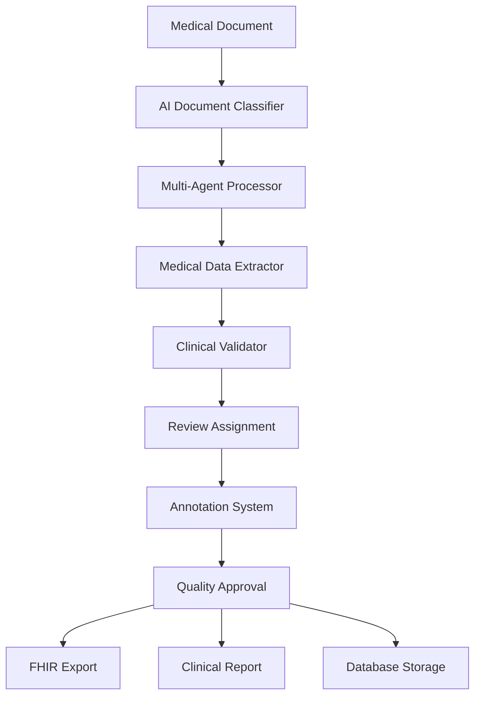

# 🏥 MediPulse: AI-Powered Medical Document Extraction Platform


**MediPulse** is a comprehensive AI-powered platform for extracting, processing, and managing medical document data. Built with **LangGraph** agentic workflows and **OpenAI GPT-4V**, it transforms unstructured medical documents into structured, actionable healthcare data with production-ready features including document review workflows, annotation systems, and FHIR-compliant exports.

## ✨ Key Features

### 🤖 **AI-Powered Processing**
- **Multi-Agent Architecture**: LangGraph workflows with specialized medical document agents
- **Vision-First Processing**: OpenAI GPT-4V for medical images, scans, and PDFs
- **Medical Domain Expertise**: Trained on healthcare terminology and clinical workflows
- **Critical Value Detection**: Automatic flagging of abnormal lab results and urgent findings

### 📋 **Professional Document Review**
- **Review Workflow System**: Complete reviewer assignment and approval process
- **Annotation Framework**: Corrections, verifications, questions, and clinical notes
- **Multi-Reviewer Support**: Role-based access (Physician, Nurse, Specialist, Technician)
- **Quality Assurance**: Confidence scoring and accuracy tracking

### 📊 **Production-Ready Exports**
- **FHIR R4 Compliance**: Healthcare interoperability standard JSON exports
- **Medical-Grade CSV**: Structured lab results for clinical analysis
- **Clinical PDF Reports**: Professional documentation with letterhead
- **Batch Processing**: Multi-document exports with proper medical formatting

### 🏥 **Healthcare Integration**
- **LOINC Code Support**: Standardized medical terminology
- **SNOMED Integration**: Clinical terminology system
- **Patient Data Management**: Secure patient record tracking
- **Audit Trail**: Complete processing and review history

## 🩺 Supported Document Types

- **📈 Laboratory Reports**: CBC, Chemistry panels, Urinalysis, Microbiology
- **🫀 Diagnostic Imaging**: EKG/ECG, X-rays, MRI/CT scan reports
- **📝 Clinical Reports**: Pathology, Operative notes, Discharge summaries
- **👤 Patient Forms**: Registration, Medical history, Consent forms
- **💊 Prescriptions**: Medication orders, Pharmacy records

## 🚀 Quick Start

### Demo Mode (Recommended)

1. **Clone and Run**
   ```bash
   git clone https://github.com/yourusername/medipulse.git
   cd medipulse
   python3 demo_server.py
   ```

2. **Open Demo Interface**
   ```
   http://localhost:8001/demo
   ```

3. **Experience the Platform**
   - Try 10+ realistic medical document types
   - Test batch operations and exports
   - Explore the review workflow system
   - Generate FHIR/CSV/PDF exports

### Production Setup

1. **Environment Setup**
   ```bash
   cp .env.example .env
   # Add your OpenAI API key to .env
   ```

2. **Install Dependencies**
   ```bash
   pip install -r requirements.txt
   ```

3. **Database Initialization**
   ```bash
   python3 database.py
   ```

4. **Run Full Stack**
   ```bash
   # Backend API
   python3 backend/main.py
   
   # Frontend (separate terminal)
   cd frontend && npm install && npm run dev
   ```

## 🏗️ Architecture



### Core Components

- **🧠 AI Processing Engine**: GPT-4V with medical prompts
- **⚡ Workflow Orchestration**: LangGraph agent coordination
- **🗄️ Data Management**: SQLite with medical schemas
- **📝 Review System**: Complete annotation and approval workflow
- **📤 Export Engine**: FHIR, CSV, and PDF generation
- **🎛️ Web Interface**: React/Next.js professional UI

## 💼 Production Features

### 🔒 **Security & Compliance**
- **Data Privacy**: Local processing, no external data storage
- **Audit Logging**: Complete processing and access trail
- **Role-Based Access**: Reviewer permissions and assignments
- **Secure Exports**: Encrypted file generation

### 📊 **Analytics & Reporting**
- **Processing Metrics**: Throughput, accuracy, review times
- **Quality Dashboard**: Confidence scores and error tracking
- **Clinical Statistics**: Patient summaries and trend analysis
- **Performance Monitoring**: Real-time system health

### 🔄 **Integration Ready**
- **REST API**: Full programmatic access
- **FHIR Compatibility**: Healthcare system integration
- **Batch Processing**: High-volume document handling
- **Webhook Support**: Event-driven workflows

## 📈 Example Outputs

### FHIR R4 JSON Export
```json
{
  "resourceType": "Bundle",
  "id": "medipulse-export-20241221",
  "type": "collection",
  "entry": [{
    "resource": {
      "resourceType": "DiagnosticReport",
      "status": "final",
      "category": [{
        "coding": [{
          "system": "http://loinc.org",
          "code": "58410-2",
          "display": "Complete blood count (CBC) panel"
        }]
      }],
      "subject": {
        "reference": "Patient/12345",
        "display": "Smith, Jane A."
      },
      "result": [{
        "reference": "Observation/hemoglobin-12345",
        "display": "Hemoglobin: 10.5 g/dL"
      }],
      "conclusion": "CRITICAL FINDINGS: Severe anemia requiring immediate evaluation"
    }
  }]
}
```

### Clinical CSV Export
```csv
Document_ID,Patient_Name,Lab_Test_Name,Result_Value,Reference_Range,Flag_Status,Critical_Alert
abc123,"Smith, Jane A.",Hemoglobin,10.5,"12.0-15.5",LOW,YES
abc123,"Smith, Jane A.",Hematocrit,31.2,"36.0-46.0",LOW,YES
```

## 📁 Project Structure

```
medipulse/
├── 🎭 demo_mode_v3.html          # Complete demo interface
├── 🏥 demo_server.py             # Demo backend server
├── 🗄️ database.py                # Medical data models
├── ⚙️ backend/
│   ├── main.py                   # FastAPI production server
│   ├── agents/                   # LangGraph medical agents
│   └── models/                   # Data schemas
├── 🎨 frontend/                  # Next.js production UI
│   ├── app/                      # React components
│   └── lib/                      # API integration
├── 📚 docs/                      # Documentation
├── 🧪 tests/                     # Test suite
├── 📄 requirements.txt           # Python dependencies
└── 🐳 docker-compose.yml         # Container deployment
```

## 🧪 Testing & Development

### Run Demo
```bash
python3 demo_server.py
# Visit http://localhost:8001/demo
```

### Run Tests
```bash
python -m pytest tests/
```

### Development Mode
```bash
# Backend with hot reload
cd backend && python main.py --reload

# Frontend with hot reload  
cd frontend && npm run dev
```

## 🔧 Configuration

### Environment Variables
```bash
# .env file
OPENAI_API_KEY=your_openai_api_key_here
DATABASE_URL=sqlite:///medipulse.db
LOG_LEVEL=INFO
DEMO_MODE=true
```

### Custom Medical Schemas
```python
from database import MediPulseDB

# Add custom document types
db = MediPulseDB()
db.add_document_type("Cardiology Report", "CARD", {
    "ecg_findings": str,
    "echo_results": dict,
    "risk_factors": list
})
```

## 🏥 Healthcare Compliance

### ⚠️ **Important Notice**
This is a **demonstration platform** for medical AI workflows. For production healthcare use:

- ✅ **HIPAA Compliance**: Implement BAA agreements and encryption
- ✅ **FDA Validation**: Clinical validation for diagnostic use
- ✅ **Security Audit**: Penetration testing and vulnerability assessment
- ✅ **Clinical Oversight**: Licensed healthcare professional supervision

### 🔒 **Security Features**
- Local data processing (no cloud transmission)
- Audit trail for all operations
- Role-based access controls
- Secure export generation

## 🚀 Deployment

### Docker Deployment
```bash
docker-compose up -d
```

### Production Deployment
```bash
# Build frontend
cd frontend && npm run build

# Run production server
python3 backend/main.py --host 0.0.0.0 --port 8000
```

## 🎯 Roadmap

- [ ] **Real-time Collaboration**: Multi-user review workflows
- [ ] **Advanced OCR**: Handwritten medical notes processing
- [ ] **EHR Integration**: Epic, Cerner, AllScripts connectors
- [ ] **Mobile App**: iOS/Android document capture
- [ ] **Voice Transcription**: Clinical dictation processing
- [ ] **ML Pipeline**: Custom model training on medical data

## 🤝 Contributing

We welcome contributions from the healthcare and AI communities!

1. **Fork the repository**
2. **Create feature branch** (`git checkout -b feature/medical-enhancement`)
3. **Commit changes** (`git commit -m 'Add clinical feature'`)
4. **Push branch** (`git push origin feature/medical-enhancement`)
5. **Open Pull Request**

### Development Guidelines
- Follow medical data handling best practices
- Include tests for new medical document types
- Document clinical workflows and use cases
- Maintain HIPAA compliance considerations

## 📜 License

This project is licensed under the **MIT License** - see [LICENSE](LICENSE) for details.

## 🏥 Medical Disclaimer

This software is for **research and development purposes only**. It is not intended for clinical diagnosis, treatment decisions, or patient care without proper medical validation and regulatory approval. Always consult qualified healthcare professionals for medical decisions.

## 🙏 Acknowledgments

- **Healthcare Professionals** who provided clinical insight
- **LangGraph Team** for agentic workflow framework
- **OpenAI** for GPT-4V medical document processing
- **FHIR Community** for healthcare interoperability standards
- **Open Source Contributors** advancing medical AI

## 📞 Support & Community

- 🐛 **Bug Reports**: [GitHub Issues](https://github.com/yourusername/medipulse/issues)
- 💬 **Discussions**: [GitHub Discussions](https://github.com/yourusername/medipulse/discussions)
- 📚 **Documentation**: [Medical AI Docs](https://docs.medipulse.ai)
- 🏥 **Healthcare Users**: [Clinical Implementation Guide](docs/clinical-guide.md)

---

**🚀 Ready to transform medical document processing?**  
**[Try the Demo](http://localhost:8001/demo)** | **[View Documentation](docs/)** | **[Join Community](https://github.com/yourusername/medipulse/discussions)**