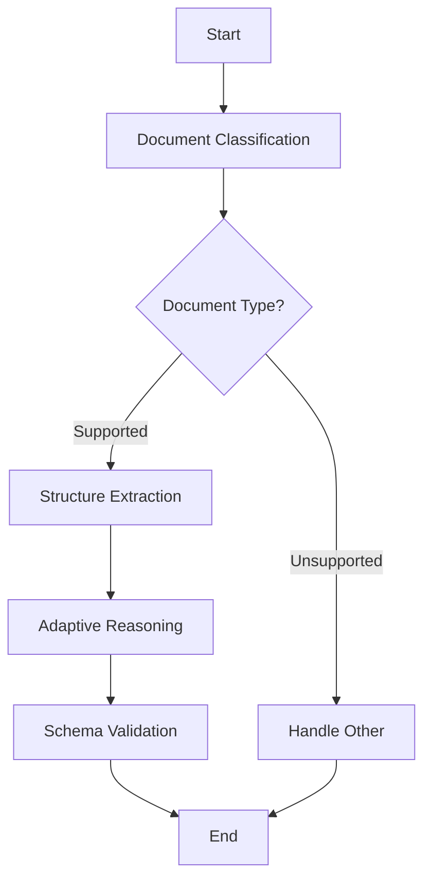

# MediPulse: Agentic Workflow for Medical Document Extraction


MediPulse is a prototype designed for medical workflows, inspired by Pulse AI's document extraction platform. It uses **LangGraph** to create an agentic workflow for extracting structured information from medical records, such as patient demographics, lab results, diagnoses, and prescriptions from scanned forms, EHR PDFs, or images.

## 🎯 Key Features

- **Agentic Architecture**: Uses LangGraph for conditional workflow routing based on document type and content analysis
- **Medical-Focused**: Tailored schemas for healthcare data (lab reports, patient intake forms, prescriptions)
- **Vision-Powered**: Leverages OpenAI's GPT-4o for robust image and text processing
- **Adaptive Processing**: Intelligent reasoning to handle ambiguities like poor scan quality or handwritten text
- **Schema Validation**: Ensures output matches medical JSON schemas with error detection
- **Zero-Shot Learning**: Handles unstructured medical data without training

## 🏥 Supported Document Types

- **Lab Reports**: Blood work, urinalysis, diagnostic test results
- **Patient Intake Forms**: Registration forms, medical history, demographics
- **Prescriptions**: Medication lists, dosages, physician orders
- **Discharge Summaries**: Hospital discharge documentation, treatment summaries

## 🚀 Quick Start

### Prerequisites

- Python 3.8+
- OpenAI API key

### Installation

1. **Clone the repository**
   ```bash
   git clone https://github.com/yourusername/medipulse.git
   cd medipulse
   ```

2. **Install dependencies**
   ```bash
   pip install -r requirements.txt
   ```

3. **Set up environment variables**
   ```bash
   cp .env.example .env
   # Edit .env and add your OpenAI API key
   ```

4. **Run the application**
   ```bash
   python src/medipulse.py
   ```

### Basic Usage

```python
from src.medipulse import MediPulse
import base64

# Initialize MediPulse
medipulse = MediPulse()

# Process from base64 string
with open('medical_document.jpg', 'rb') as f:
    image_data = f.read()
    image_base64 = base64.b64encode(image_data).decode('utf-8')

result = medipulse.process_document(image_base64)

# Or process directly from file
result = medipulse.process_document_from_file('path/to/medical_document.jpg')

print("Extracted Data:", result['extracted_data'])
```

## 🏗️ Architecture

MediPulse implements an agentic workflow with the following nodes:



### Workflow Nodes

1. **Document Classification**: Uses OpenAI vision to identify document type (lab report, intake form, etc.)
2. **Structure Extraction**: Extracts relevant medical data based on document type
3. **Adaptive Reasoning**: Resolves ambiguities and enhances data quality
4. **Schema Validation**: Validates extracted data against medical schemas
5. **Conditional Routing**: Routes processing based on document type and quality

## 📊 Example Output

### Lab Report Processing
```json
{
  "success": true,
  "doc_classification": {
    "doc_type": "lab_report",
    "confidence": 0.95,
    "reasoning": "Document contains laboratory test results with reference ranges"
  },
  "extracted_data": {
    "patient_name": "John Doe",
    "patient_id": "12345",
    "date_of_service": "2025-08-16",
    "physician_name": "Dr. Smith",
    "lab_results": {
      "Hemoglobin": "14.2 g/dL",
      "White Blood Cells": "7,200 /μL",
      "Glucose": "95 mg/dL"
    },
    "confidence_score": 0.92
  },
  "validation": {
    "is_valid": true,
    "errors": [],
    "warnings": [],
    "completeness_score": 0.85
  }
}
```

## 🧪 Testing

Run the test suite:
```bash
python -m pytest tests/
```

Create test documents:
```bash
python examples/create_test_documents.py
```

## 🔧 Configuration

### Environment Variables

Create a `.env` file:
```bash
OPENAI_API_KEY=your_openai_api_key_here
```

### Custom Configuration

```python
from src.medipulse import MediPulse, MediPulseConfig

# Custom configuration
config = MediPulseConfig()
config.model = "gpt-4o-mini"  # Use different OpenAI model

medipulse = MediPulse(config)
```

## 📁 Project Structure

```
medipulse/
├── src/
│   └── medipulse.py          # Main application code
├── examples/
│   ├── demo.py               # Usage examples
│   └── create_test_documents.py
├── tests/
│   ├── test_medipulse.py     # Unit tests
│   └── test_data/            # Sample test documents
├── docs/
│   └── api.md                # API documentation
├── requirements.txt          # Dependencies
├── .env.example             # Environment template
├── README.md                # This file
├── LICENSE                  # MIT License
└── setup.py                 # Package configuration
```

## 🚨 Important Notes

### HIPAA Compliance
⚠️ **This is a prototype for demonstration purposes.** For production use in healthcare environments:
- Implement proper HIPAA compliance measures
- Add encryption for data in transit and at rest
- Implement audit logging and access controls
- Ensure secure API endpoints and authentication

### Limitations
- Designed for image inputs (convert PDFs to images using `pdf2image`)
- Requires OpenAI API key and internet connection
- Processing time depends on image complexity and API response times
- Not suitable for production medical environments without additional security measures

## 🔮 Future Enhancements

- [ ] PDF direct processing support
- [ ] Batch document processing
- [ ] RESTful API endpoint
- [ ] Integration with major EHR systems
- [ ] FHIR compliance for medical data interchange
- [ ] On-premise deployment options
- [ ] Multi-language support
- [ ] Advanced OCR for handwritten text

## 🤝 Contributing

We welcome contributions! Please see our contributing guidelines:

1. Fork the repository
2. Create a feature branch (`git checkout -b feature/amazing-feature`)
3. Commit your changes (`git commit -m 'Add amazing feature'`)
4. Push to the branch (`git push origin feature/amazing-feature`)
5. Open a Pull Request

## 📜 License

This project is licensed under the MIT License - see the [LICENSE](LICENSE) file for details.

## 🙏 Acknowledgments

- Inspired by Pulse AI's document extraction platform
- Built with [LangGraph](https://github.com/langchain-ai/langgraph) for agentic workflows
- Powered by [OpenAI](https://openai.com) GPT-4o for vision and language processing
- Thanks to the open-source community for making this possible

## 📞 Support

- 📧 Create an issue for bug reports or feature requests
- 💬 Discussions for questions and community support
- 📖 Check the [documentation](docs/) for detailed information

---

**Disclaimer**: This software is for research and development purposes. It is not intended for use in production medical environments without proper validation, security measures, and regulatory compliance.
