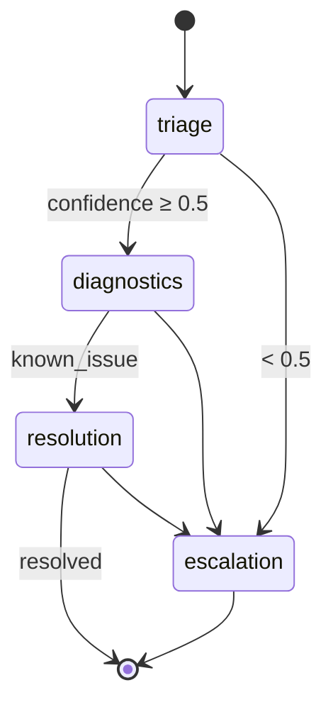

# Giggle AI L1 Support **MVP v2** – LangGraph + LangChain + GPT-4o mini Edition  
*Updated: 2025-06-17*

---

## 0️⃣ Why This Revision?

The original MVP used simple Python classes.  
**LangGraph** provides a declarative state‑machine and **GPT‑4o mini** delivers cost‑effective triage.

---

## 1️⃣ Dependencies

| Library | Purpose |
|---------|---------|
| `langchain` | LLM + Runnable API |
| `langgraph` | Graph orchestration |
| `openai` | GPT‑4o mini access |
| `fastapi`, `celery` | Transport & task queue |
| `redis` | Broker |

```bash
poetry add langchain langgraph openai
```

---

## 2️⃣ Mermaid Overview



---

## 3️⃣ Core Snippets

### `graph.py`

```python
sg.add_conditional_edges(
    "triage",
    lambda s: "diagnostics" if s["confidence"] >= 0.5 else "escalation",
)
```

### `triage.py` (GPT‑4o mini)

```python
llm = ChatOpenAI(model="gpt-4o-mini", temperature=0)
prompt = ChatPromptTemplate.from_messages([
    ("system", "Classify summary into NETWORK, DATABASE, APPLICATION, SECURITY, OTHER; JSON only."),
    ("human", "{{summary}}"),
])
```

### Celery trigger

```python
graph = build_graph()
@celery_app.task
def orchestrate_incident(id, summ, svc):
    return graph.invoke({{"summary": summ, "service_name": svc}})
```

---

## 4️⃣ Quick Demo

```python
from app.graph import build_graph
result = build_graph().invoke({{"summary": "Timeout on db", "service_name": "orders-api"}})
print(result)
```

---

Happy graph‑hacking! ✨
