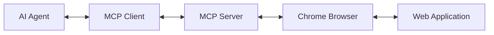

# Chrome DevTools MCP for AI Engineering: Complete Tutorial

> **🚀 Just Released**: Google launched Chrome DevTools MCP Server on September 23, 2025, enabling AI agents to directly debug and control live Chrome browsers via the Model Context Protocol.

## Table of Contents

- [Overview](#overview)
- [Prerequisites](#prerequisites)  
- [Understanding MCP and Chrome DevTools Integration](#understanding-mcp-and-chrome-devtools-integration)
- [Installation & Setup](#installation--setup)
- [Basic Configuration](#basic-configuration)
- [Your First Chrome DevTools MCP Session](#your-first-chrome-devtools-mcp-session)
- [Core Tools and Capabilities](#core-tools-and-capabilities)
- [Advanced Usage Examples](#advanced-usage-examples)
- [Building Custom AI Agents](#building-custom-ai-agents)
- [Production Best Practices](#production-best-practices)
- [Troubleshooting](#troubleshooting)
- [Performance Optimization](#performance-optimization)
- [Security Considerations](#security-considerations)
- [Integration with Popular AI Frameworks](#integration-with-popular-ai-frameworks)
- [Real-World Use Cases](#real-world-use-cases)
- [Contributing and Community](#contributing-and-community)

## Overview

Chrome DevTools MCP Server bridges the gap between AI coding assistants and browser reality. Instead of AI agents making speculative fixes, they can now ground their decisions in live browser data, automating debugging workflows with unprecedented accuracy.

### Key Benefits

- **🔠Real Browser Debugging**: AI agents can inspect DOM, CSS, network requests, and console logs in real-time
- **âš¡ Performance Analysis**: Automated performance tracing and Core Web Vitals analysis  
- **🤖 Intelligent Automation**: AI-driven user flow simulation and bug reproduction
- **📊 Data-Driven Decisions**: Grounded in actual browser telemetry, not guesswork
- **🔧 Developer Productivity**: Up to 30% reduction in debugging time based on early trials

### What's New

- **September 23, 2025**: Public preview launch by Google Chrome DevTools team
- Built on Anthropic's MCP standard (introduced late 2024)
- First-party integration with Chrome DevTools Protocol (CDP)
- Native support for popular AI coding assistants

## Prerequisites

Before starting, ensure you have:

### Required Software

- **Node.js**: Version 18+ ([Download](https://nodejs.org))
- **Google Chrome**: Version 130+ (latest stable recommended)
- **Terminal/Command Line**: Basic familiarity required

### AI Coding Assistant

Choose one of the following MCP-compatible clients:

- **Claude Desktop**: [Download](https://claude.ai/download) (Recommended)
- **Cursor IDE**: [Download](https://cursor.sh)
- **VS Code with Copilot**: Install MCP extension
- **Gemini CLI**: `npm install -g @google/gemini-cli`

### API Keys (if needed)

- **Claude**: Get from [Anthropic Console](https://console.anthropic.com)
- **Gemini**: Get from [Google AI Studio](https://makersuite.google.com)

### Verification

```bash
# Verify Node.js installation
node -v  # Should output v18+

# Verify npm
npm -v   # Should output a version number

# Verify Chrome
google-chrome --version  # Linux
# or check About Chrome in browser menu
```

## Understanding MCP and Chrome DevTools Integration

### What is Model Context Protocol (MCP)?

MCP is an open-source standard from Anthropic that standardizes how LLMs access external tools and data sources. Think of it as a "USB-C port for AI agents."



### Architecture Components

1. **MCP Client**: Built into your AI coding assistant
2. **Chrome DevTools MCP Server**: Exposes Chrome DevTools via MCP
3. **Chrome DevTools Protocol (CDP)**: Low-level browser automation API
4. **Chrome Browser**: The actual browser instance being controlled

### How It Works

```javascript
// Example: AI agent workflow
1. AI receives user prompt: "Check why localhost:3000 is slow"
2. MCP client calls: performance_start_trace()  
3. Chrome opens, navigates to localhost:3000
4. DevTools records performance trace
5. AI analyzes LCP, render-blocking resources
6. AI suggests: "Optimize image loading, defer non-critical JS"
```

## Installation & Setup

### Method 1: Quick Start (Recommended)

The Chrome DevTools MCP Server runs via `npx` - no global installation needed.

```bash
# Test if everything works
npx chrome-devtools-mcp@latest --help
```

### Method 2: Global Installation

```bash
# Install globally (optional)
npm install -g chrome-devtools-mcp

# Verify installation
chrome-devtools-mcp --version
```

### Method 3: Local Development

```bash
# Clone for development/contribution
git clone https://github.com/ChromeDevTools/chrome-devtools-mcp.git
cd chrome-devtools-mcp
npm install
npm run build
npm start
```

## Basic Configuration

### Claude Desktop Setup

1. **Open Claude Desktop Settings**
   - macOS: Claude Menu → Settings → Developer
   - Windows: File → Settings → Developer

2. **Edit Configuration File**
   ```json
   {
     "mcpServers": {
       "chrome-devtools": {
         "command": "npx",
         "args": ["chrome-devtools-mcp@latest"]
       }
     }
   }
   ```

3. **Restart Claude Desktop**

4. **Verify Connection**
   - Look for hammer icon (🔨) in Claude interface
   - Should show "chrome-devtools" server connected

### Cursor IDE Setup

1. **Open Settings**: `Cmd/Ctrl + ,`
2. **Navigate to**: Features → MCP Servers  
3. **Add New Server**:
   ```json
   {
     "name": "chrome-devtools",
     "command": "npx", 
     "args": ["chrome-devtools-mcp@latest"]
   }
   ```

### Gemini CLI Setup

```bash
# Install Gemini CLI
npm install -g @google/gemini-cli

# Configure API key
gemini config --api-key YOUR_API_KEY

# Add MCP server to config (~/.gemini/config.json)
{
  "mcpServers": {
    "chrome-devtools": {
      "command": "npx",
      "args": ["chrome-devtools-mcp@latest"]
    }
  }
}
```

### VS Code Setup

1. **Install MCP Extension** from marketplace
2. **Configure in settings.json**:
   ```json
   {
     "mcp.servers": {
       "chrome-devtools": {
         "command": "npx",
         "args": ["chrome-devtools-mcp@latest"]
       }
     }
   }
   ```

## Your First Chrome DevTools MCP Session

### Create a Test Website

```bash
# Create a simple test site
mkdir mcp-test-site
cd mcp-test-site

# Create index.html
cat > index.html << 'EOF'
<!DOCTYPE html>
<html lang="en">
<head>
    <meta charset="UTF-8">
    <meta name="viewport" content="width=device-width, initial-scale=1.0">
    <title>MCP Test Site</title>
    <style>
        body { font-family: Arial, sans-serif; margin: 40px; }
        .slow-image { width: 100%; height: 400px; background: url('https://picsum.photos/2000/1000') center/cover; }
        .broken-image { width: 200px; height: 200px; background: url('nonexistent.jpg'); border: 1px solid red; }
        .form-section { margin: 20px 0; padding: 20px; border: 1px solid #ccc; }
    </style>
</head>
<body>
    <h1>MCP Test Site</h1>
    <div class="slow-image"></div>
    
    <div class="broken-image"></div>
    
    <div class="form-section">
        <form id="test-form">
            <input type="email" placeholder="Enter email" required>
            <button type="submit">Submit</button>
        </form>
    </div>

    <script>
        console.log('Page loaded');
        
        // Intentional error for testing
        setTimeout(() => {
            nonexistentFunction();
        }, 2000);

        // Form handler
        document.getElementById('test-form').onsubmit = (e) => {
            e.preventDefault();
            console.log('Form submitted');
        };
    </script>
</body>
</html>
EOF

# Start local server
npx http-server . -p 8080
```

### Test Basic Functionality

Open your AI coding assistant and try these prompts:

#### 1. Performance Analysis
```
Check the performance of http://localhost:8080 and suggest improvements.
```

**Expected AI Response:**
- AI launches Chrome, navigates to the site
- Records performance trace
- Analyzes Core Web Vitals (LCP, FID, CLS)
- Suggests optimizing large background image
- Recommends image compression or lazy loading

#### 2. Debug Broken Resources  
```
A few images on localhost:8080 are not loading. What's happening?
```

**Expected AI Response:**
- AI inspects network requests
- Identifies 404 error for `nonexistent.jpg`
- Explains the CSS is referencing a missing image file
- Suggests fixing the image path or removing the CSS rule

#### 3. JavaScript Error Detection
```
Check for JavaScript errors on localhost:8080
```

**Expected AI Response:**
- AI opens Developer Console  
- Detects `ReferenceError: nonexistentFunction is not defined`
- Explains the error occurs 2 seconds after page load
- Suggests fixing or removing the setTimeout call

#### 4. Form Functionality Test
```
Test the email form on localhost:8080 - does it work properly?
```

**Expected AI Response:**
- AI simulates filling out the form
- Submits with test email address
- Observes console.log output
- Confirms form prevents default submission
- Notes that form validation is working

## Core Tools and Capabilities

### Performance Tools

#### `performance_start_trace`
Records browser performance metrics and generates actionable insights.

```javascript
// Example usage by AI agent
const trace = await mcpClient.callTool({
  name: 'performance_start_trace',
  arguments: {
    url: 'https://example.com',
    duration: 10000  // 10 seconds
  }
});
```

**Metrics Captured:**
- Largest Contentful Paint (LCP)
- First Input Delay (FID) 
- Cumulative Layout Shift (CLS)
- Time to First Byte (TTFB)
- DOM Content Loaded
- Load Event timing

#### `performance_get_insights`
Analyzes performance data and provides optimization suggestions.

### Network Tools

#### `network_get_requests`
Lists all network requests with detailed information.

```javascript
// Returns array of network requests
[
  {
    url: "https://example.com/api/data",
    method: "GET", 
    status: 200,
    responseTime: 245,
    size: 1024,
    type: "xhr"
  }
]
```

#### `network_monitor_start`
Begins monitoring network activity in real-time.

#### `network_get_failed_requests`
Identifies requests that failed (4xx, 5xx errors, timeouts).

### DOM & CSS Tools

#### `dom_inspect_element`
Inspects DOM elements and their computed styles.

```javascript
await mcpClient.callTool({
  name: 'dom_inspect_element', 
  arguments: {
    selector: '.broken-image'
  }
});
// Returns element properties, styles, dimensions
```

#### `dom_query_elements`
Finds elements matching CSS selectors.

#### `css_get_computed_styles`
Returns computed CSS styles for elements.

### Console Tools

#### `console_get_messages`
Retrieves browser console output (logs, errors, warnings).

```javascript
// Returns console messages
[
  {
    level: "error",
    text: "ReferenceError: nonexistentFunction is not defined",
    timestamp: "2025-09-24T10:30:45.123Z",
    source: "script.js:15"
  }
]
```

#### `console_evaluate`
Executes JavaScript in the browser context.

### User Interaction Tools

#### `user_click`
Simulates clicking on elements.

#### `user_fill_form`  
Fills out form fields with specified data.

#### `user_navigate`
Navigates to specified URLs.

#### `user_scroll`
Scrolls the page to specific elements or positions.

### Screenshot & Visual Tools

#### `screenshot_capture`
Takes full-page or element-specific screenshots.

#### `screenshot_compare`
Compares before/after screenshots for visual regression testing.

## Advanced Usage Examples

### Example 1: Automated Performance Audit

Create a comprehensive performance audit workflow:

```markdown
Prompt: "Run a complete performance audit on localhost:8080 and create an optimization report"
```

**AI Workflow:**
1. Navigate to site
2. Record performance trace  
3. Capture screenshots
4. Analyze network waterfall
5. Check for render-blocking resources
6. Generate detailed report with recommendations

**Example Output:**
```
Performance Audit Report for localhost:8080

🔴 Issues Found:
- LCP: 3.2s (Poor) - Large background image (2MB)
- JavaScript Error: nonexistentFunction() at line 15
- Missing resource: nonexistent.jpg (404 error)

🟡 Recommendations:
1. Compress background image or use WebP format
2. Implement lazy loading for images
3. Fix JavaScript error in setTimeout
4. Remove reference to missing image file

📊 Metrics:
- Page Size: 2.1MB  
- Requests: 8
- Load Time: 3.4s
- Time to Interactive: 3.8s
```

### Example 2: Bug Reproduction & Analysis

```markdown
Prompt: "The form submission seems broken. Investigate and provide a fix."
```

**AI Investigation Process:**
1. Inspect form HTML structure
2. Check form event handlers
3. Monitor console during submission
4. Analyze network requests during submit
5. Test with various input combinations
6. Provide code fix

**AI Analysis:**
```
Form Analysis Results:

✅ Form Structure: Valid HTML5 form with email input
✅ Validation: Required attribute present, validates email format
✅ Event Handler: preventDefault() correctly implemented 
✅ Console Output: "Form submitted" message appears

📠Findings:
The form is working correctly - it prevents default submission 
and logs to console. If you expected server submission, you need
to add an action attribute and server endpoint.

💡 Fix Options:
1. Add action="/submit" to post to server
2. Add AJAX submission handler
3. Add success/error user feedback
```

### Example 3: Responsive Design Testing

```markdown
Prompt: "Test how localhost:8080 looks on mobile devices and report any issues"
```

**AI Testing Process:**
1. Emulate iPhone 12 viewport
2. Capture screenshot
3. Check for horizontal scrolling
4. Test tap targets
5. Verify text readability  
6. Test form usability

### Example 4: Cross-Browser Compatibility

```markdown
Prompt: "Check if there are any browser-specific issues with this site"
```

**AI Analysis:**
1. Check CSS vendor prefixes
2. Verify ES6+ JavaScript features
3. Test web APIs usage
4. Validate HTML5 semantics
5. Check for deprecated features

### Example 5: SEO & Accessibility Audit

```markdown
Prompt: "Audit localhost:8080 for SEO and accessibility issues"
```

**AI Audit Areas:**
- Meta tags and structured data
- Image alt attributes
- Heading hierarchy (h1, h2, h3)
- Color contrast ratios
- Keyboard navigation
- Screen reader compatibility
- Page load performance impact on SEO

## Building Custom AI Agents

### Creating a Node.js MCP Client

```javascript
// chrome-debug-agent.js
import { GoogleGenerativeAI } from '@google/generative-ai';
import { Client } from '@modelcontextprotocol/sdk/client/index.js';
import { StdioServerParameters, StdioClientTransport } from '@modelcontextprotocol/sdk/client/stdio.js';

class ChromeDebugAgent {
  constructor(apiKey) {
    this.genAI = new GoogleGenerativeAI(apiKey);
    this.model = this.genAI.getGenerativeModel({ model: 'gemini-1.5-pro' });
    this.mcpClient = null;
  }

  async initializeMCP() {
    const serverParams = new StdioServerParameters({
      command: 'npx',
      args: ['chrome-devtools-mcp@latest']
    });
    
    const transport = new StdioClientTransport(serverParams);
    this.mcpClient = new Client({
      name: "chrome-debug-agent",
      version: "1.0.0"
    }, {
      capabilities: {}
    });

    await this.mcpClient.connect(transport);
    console.log('Connected to Chrome DevTools MCP Server');
  }

  async analyzeWebsite(url) {
    // Start performance trace
    const traceResult = await this.mcpClient.request({
      method: 'tools/call',
      params: {
        name: 'performance_start_trace',
        arguments: { url, duration: 10000 }
      }
    });

    // Get console errors
    const consoleResult = await this.mcpClient.request({
      method: 'tools/call', 
      params: {
        name: 'console_get_messages',
        arguments: {}
      }
    });

    // Analyze with AI
    const prompt = `
      Analyze this website performance data:
      
      Performance: ${JSON.stringify(traceResult.content)}
      Console: ${JSON.stringify(consoleResult.content)}
      
      Provide actionable recommendations for improvements.
    `;

    const result = await this.model.generateContent(prompt);
    return result.response.text();
  }

  async debugForm(selector) {
    // Inspect form element
    const formData = await this.mcpClient.request({
      method: 'tools/call',
      params: {
        name: 'dom_inspect_element',
        arguments: { selector }
      }
    });

    // Test form submission
    await this.mcpClient.request({
      method: 'tools/call',
      params: {
        name: 'user_fill_form',
        arguments: { 
          selector: `${selector} input[type="email"]`,
          value: 'test@example.com'
        }
      }
    });

    await this.mcpClient.request({
      method: 'tools/call',
      params: {
        name: 'user_click',
        arguments: { selector: `${selector} button[type="submit"]` }
      }
    });

    // Check for errors after submission
    const errors = await this.mcpClient.request({
      method: 'tools/call',
      params: {
        name: 'console_get_messages',
        arguments: { level: 'error' }
      }
    });

    return {
      formStructure: formData.content,
      submissionErrors: errors.content
    };
  }
}

// Usage example
async function main() {
  const agent = new ChromeDebugAgent(process.env.GEMINI_API_KEY);
  await agent.initializeMCP();
  
  const analysis = await agent.analyzeWebsite('http://localhost:8080');
  console.log(analysis);
  
  const formDebug = await agent.debugForm('#test-form');  
  console.log('Form debug results:', formDebug);
}

main().catch(console.error);
```

### Running the Custom Agent

```bash
# Install dependencies
npm init -y
npm install @google/generative-ai @modelcontextprotocol/sdk

# Set API key
export GEMINI_API_KEY="your-api-key"

# Run the agent
node chrome-debug-agent.js
```

### Python MCP Client Example

```python
# chrome_debug_agent.py
import asyncio
import json
from mcp import ClientSession, StdioServerParameters
from mcp.client.stdio import stdio_client
from anthropic import Anthropic

class ChromeDebugAgent:
    def __init__(self, anthropic_api_key):
        self.anthropic = Anthropic(api_key=anthropic_api_key)
        self.session = None
        
    async def initialize(self):
        server_params = StdioServerParameters(
            command="npx",
            args=["chrome-devtools-mcp@latest"],
            env=None
        )
        
        stdio_transport = stdio_client(server_params)
        stdio, write = await stdio_transport.__aenter__()
        self.session = ClientSession(stdio, write)
        await self.session.initialize()
        
        print("Connected to Chrome DevTools MCP")
        
    async def analyze_performance(self, url):
        # Start performance trace
        result = await self.session.call_tool(
            name="performance_start_trace",
            arguments={"url": url, "duration": 10000}
        )
        
        # Analyze with Claude
        message = self.anthropic.messages.create(
            model="claude-3-5-sonnet-20241022",
            max_tokens=1000,
            messages=[{
                "role": "user", 
                "content": f"Analyze this performance data and suggest optimizations: {json.dumps(result.content)}"
            }]
        )
        
        return message.content[0].text
        
    async def debug_javascript_errors(self, url):
        # Navigate to URL
        await self.session.call_tool(
            name="user_navigate",
            arguments={"url": url}
        )
        
        # Wait for page load and errors
        await asyncio.sleep(3)
        
        # Get console messages
        console_result = await self.session.call_tool(
            name="console_get_messages",
            arguments={"level": "error"}
        )
        
        if console_result.content:
            # Analyze errors with Claude
            message = self.anthropic.messages.create(
                model="claude-3-5-sonnet-20241022",
                max_tokens=500,
                messages=[{
                    "role": "user",
                    "content": f"Explain these JavaScript errors and suggest fixes: {json.dumps(console_result.content)}"
                }]
            )
            
            return message.content[0].text
        else:
            return "No JavaScript errors found!"

async def main():
    agent = ChromeDebugAgent("your-claude-api-key")
    await agent.initialize()
    
    # Test performance analysis
    perf_analysis = await agent.analyze_performance("http://localhost:8080")
    print("Performance Analysis:")
    print(perf_analysis)
    print("\n" + "="*50 + "\n")
    
    # Test error debugging  
    error_analysis = await agent.debug_javascript_errors("http://localhost:8080")
    print("JavaScript Error Analysis:")
    print(error_analysis)

if __name__ == "__main__":
    asyncio.run(main())
```

## Production Best Practices

### 1. Security Configuration

```json
{
  "mcpServers": {
    "chrome-devtools": {
      "command": "npx",
      "args": [
        "chrome-devtools-mcp@latest",
        "--headless",
        "--no-sandbox",
        "--disable-dev-shm-usage"
      ],
      "env": {
        "CHROME_EXECUTABLE_PATH": "/usr/bin/google-chrome-stable"
      }
    }
  }
}
```

### 2. Resource Management

```javascript
// Implement connection pooling
class ChromeMCPPool {
  constructor(maxConnections = 5) {
    this.pool = [];
    this.maxConnections = maxConnections;
    this.activeConnections = 0;
  }
  
  async getConnection() {
    if (this.pool.length > 0) {
      return this.pool.pop();
    }
    
    if (this.activeConnections < this.maxConnections) {
      return await this.createConnection();
    }
    
    // Wait for available connection
    return new Promise((resolve) => {
      this.waitingQueue.push(resolve);
    });
  }
  
  async releaseConnection(connection) {
    if (this.waitingQueue.length > 0) {
      const resolve = this.waitingQueue.shift();
      resolve(connection);
    } else {
      this.pool.push(connection);
    }
  }
}
```

### 3. Error Handling & Retry Logic

```javascript
class RobustChromeAgent {
  async executeWithRetry(operation, maxRetries = 3) {
    let lastError;
    
    for (let attempt = 1; attempt <= maxRetries; attempt++) {
      try {
        return await operation();
      } catch (error) {
        lastError = error;
        console.warn(`Attempt ${attempt} failed:`, error.message);
        
        if (attempt < maxRetries) {
          await this.delay(1000 * attempt); // Exponential backoff
        }
      }
    }
    
    throw new Error(`Operation failed after ${maxRetries} attempts: ${lastError.message}`);
  }
  
  delay(ms) {
    return new Promise(resolve => setTimeout(resolve, ms));
  }
}
```

### 4. Monitoring & Logging

```javascript
// Add comprehensive logging
class MonitoredChromeAgent {
  constructor() {
    this.metrics = {
      totalRequests: 0,
      successfulRequests: 0,
      failedRequests: 0,
      averageResponseTime: 0
    };
  }
  
  async callTool(name, arguments) {
    const startTime = Date.now();
    this.metrics.totalRequests++;
    
    try {
      const result = await this.mcpClient.request({
        method: 'tools/call',
        params: { name, arguments }
      });
      
      this.metrics.successfulRequests++;
      const responseTime = Date.now() - startTime;
      this.updateAverageResponseTime(responseTime);
      
      console.log(`✅ ${name} completed in ${responseTime}ms`);
      return result;
      
    } catch (error) {
      this.metrics.failedRequests++;
      console.error(`⌠${name} failed:`, error.message);
      throw error;
    }
  }
  
  getMetrics() {
    return {
      ...this.metrics,
      successRate: (this.metrics.successfulRequests / this.metrics.totalRequests) * 100
    };
  }
}
```

### 5. Docker Deployment

```dockerfile
# Dockerfile
FROM node:18-alpine

# Install Chrome
RUN apk add --no-cache \
    chromium \
    nss \
    freetype \
    freetype-dev \
    harfbuzz \
    ca-certificates \
    ttf-freefont

# Set Chrome executable path
ENV CHROME_EXECUTABLE_PATH=/usr/bin/chromium-browser
ENV CHROME_FLAGS="--headless --no-sandbox --disable-dev-shm-usage"

WORKDIR /app
COPY package*.json ./
RUN npm ci --only=production

COPY . .
CMD ["npm", "start"]
```

```yaml
# docker-compose.yml
version: '3.8'
services:
  chrome-mcp-agent:
    build: .
    environment:
      - NODE_ENV=production
      - CHROME_EXECUTABLE_PATH=/usr/bin/chromium-browser
      - MAX_CONCURRENT_SESSIONS=3
    volumes:
      - ./logs:/app/logs
    restart: unless-stopped
    deploy:
      resources:
        limits:
          memory: 1G
          cpus: '0.5'
```

## Troubleshooting

### Common Issues & Solutions

#### 1. Connection Failures

**Problem**: `Failed to connect to Chrome DevTools MCP Server`

**Solutions**:
```bash
# Check Node.js version
node -v  # Must be 18+

# Check if npx can run the package
npx chrome-devtools-mcp@latest --help

# Clear npm cache
npm cache clean --force

# Try explicit version
npx chrome-devtools-mcp@1.0.0
```

#### 2. Chrome Launch Issues  

**Problem**: `Chrome failed to launch`

**Solutions**:
```bash
# For Linux headless environments
export CHROME_FLAGS="--no-sandbox --disable-dev-shm-usage"

# For custom Chrome installation
export CHROME_EXECUTABLE_PATH="/path/to/chrome"

# Test Chrome manually
google-chrome --headless --remote-debugging-port=9222
```

#### 3. Permission Errors

**Problem**: `EACCES: permission denied`

**Solutions**:
```bash
# Fix npm permissions
sudo chown -R $(whoami) ~/.npm

# Or use nvm (recommended)
curl -o- https://raw.githubusercontent.com/nvm-sh/nvm/v0.39.0/install.sh | bash
nvm install 18
nvm use 18
```

#### 4. Performance Issues

**Problem**: High memory usage or timeouts

**Solutions**:
```javascript
// Configure resource limits
{
  "mcpServers": {
    "chrome-devtools": {
      "command": "npx", 
      "args": [
        "chrome-devtools-mcp@latest",
        "--max-old-space-size=512",
        "--max-memory-restart=1000"
      ]
    }
  }
}
```

#### 5. Network/Firewall Issues

**Problem**: Cannot connect to local servers

**Solutions**:
```bash
# Check if port is available
netstat -tulpn | grep :8080

# Test with curl
curl http://localhost:8080

# Configure firewall (Ubuntu/Debian)
sudo ufw allow 8080
```

### Debug Mode & Logging

Enable detailed logging for troubleshooting:

```json
{
  "mcpServers": {
    "chrome-devtools": {
      "command": "npx",
      "args": ["chrome-devtools-mcp@latest", "--verbose"],
      "env": {
        "DEBUG": "chrome-devtools-mcp:*",
        "LOG_LEVEL": "debug"
      }
    }
  }
}
```

### Getting Help

1. **Check Server Status**:
   ```bash
   npx chrome-devtools-mcp@latest --health-check
   ```

2. **View Logs**:
   - Claude Desktop: Help → View Logs
   - Cursor: Output Panel → MCP Servers
   - Command Line: `DEBUG=* npx chrome-devtools-mcp@latest`

3. **Community Support**:
   - GitHub Issues: [ChromeDevTools/chrome-devtools-mcp](https://github.com/ChromeDevTools/chrome-devtools-mcp)
   - MCP Discord: [Join MCP Community](https://discord.gg/mcp)
   - Stack Overflow: Tag `chrome-devtools-mcp`

## Performance Optimization

### 1. Optimize Chrome Launch

```javascript
// Custom Chrome launch options for better performance
const chromeOptions = {
  headless: true,
  args: [
    '--no-sandbox',
    '--disable-dev-shm-usage', 
    '--disable-gpu',
    '--disable-extensions',
    '--disable-plugins',
    '--disable-images',  // For performance testing only
    '--disable-javascript', // When JS not needed
    '--memory-pressure-off',
    '--max_old_space_size=4096'
  ]
};
```

### 2. Connection Reuse

```javascript
// Reuse Chrome instances instead of launching new ones
class OptimizedChromeAgent {
  constructor() {
    this.chromeInstance = null;
  }
  
  async ensureChromeInstance() {
    if (!this.chromeInstance) {
      this.chromeInstance = await this.launchChrome();
    }
    return this.chromeInstance;
  }
  
  async cleanup() {
    if (this.chromeInstance) {
      await this.chromeInstance.close();
      this.chromeInstance = null;
    }
  }
}
```

### 3. Batch Operations

```javascript
// Group multiple operations together
async function batchAnalysis(urls) {
  const results = [];
  
  // Open all URLs in different tabs
  for (const url of urls) {
    await mcpClient.callTool('user_navigate', { 
      url, 
      newTab: true 
    });
  }
  
  // Collect data from all tabs
  const tabs = await mcpClient.callTool('get_all_tabs', {});
  
  for (const tab of tabs) {
    const performance = await mcpClient.callTool('performance_start_trace', {
      tabId: tab.id,
      duration: 5000
    });
    results.push({ url: tab.url, performance });
  }
  
  return results;
}
```

### 4. Selective Data Collection

```javascript
// Only collect needed data to improve performance
const minimalConfig = {
  performance: {
    collectTimings: true,
    collectNetwork: false,  // Skip if not needed
    collectScreenshots: false
  },
  console: {
    levels: ['error', 'warn'],  // Skip debug/info
    maxMessages: 100
  }
};
```

## Security Considerations

### 1. Sandbox Chrome Processes

```bash
# Always run with security flags
chrome-devtools-mcp --chrome-flags="--no-sandbox --disable-extensions --disable-plugins"
```

### 2. Network Restrictions

```javascript
// Implement URL allowlists
const allowedDomains = [
  'localhost',
  '127.0.0.1', 
  'staging.example.com',
  'dev.example.com'
];

function isUrlAllowed(url) {
  const domain = new URL(url).hostname;
  return allowedDomains.includes(domain);
}
```

### 3. Data Sanitization

```javascript
// Sanitize sensitive data before AI analysis
function sanitizeData(data) {
  const sensitive = [
    /\b[A-Za-z0-9._%+-]+@[A-Za-z0-9.-]+\.[A-Z|a-z]{2,}\b/g, // emails
    /\b\d{4}[-\s]?\d{4}[-\s]?\d{4}[-\s]?\d{4}\b/g, // credit cards
    /\b(?:\d{1,3}\.){3}\d{1,3}\b/g // IP addresses
  ];
  
  let sanitized = JSON.stringify(data);
  sensitive.forEach(pattern => {
    sanitized = sanitized.replace(pattern, '[REDACTED]');
  });
  
  return JSON.parse(sanitized);
}
```

### 4. Access Control

```javascript
// Implement role-based access
class SecureChromeAgent {
  constructor(userRole) {
    this.permissions = this.getPermissions(userRole);
  }
  
  getPermissions(role) {
    const roles = {
      'viewer': ['screenshot_capture', 'performance_start_trace'],
      'developer': ['*'], // All permissions
      'tester': ['user_click', 'user_fill_form', 'screenshot_capture']
    };
    return roles[role] || [];
  }
  
  async callTool(name, args) {
    if (!this.hasPermission(name)) {
      throw new Error(`Access denied for tool: ${name}`);
    }
    return super.callTool(name, args);
  }
}
```

## Integration with Popular AI Frameworks

### LangChain Integration

```javascript
// chrome-devtools-tool.js
import { Tool } from "langchain/tools";

export class ChromeDevToolsTool extends Tool {
  name = "chrome_devtools";
  description = "Analyze web pages using Chrome DevTools";

  constructor(mcpClient) {
    super();
    this.mcpClient = mcpClient;
  }

  async _call(input) {
    const { action, url, ...params } = JSON.parse(input);
    
    switch (action) {
      case 'analyze_performance':
        return await this.mcpClient.callTool('performance_start_trace', {
          url,
          duration: params.duration || 10000
        });
        
      case 'check_errors':
        await this.mcpClient.callTool('user_navigate', { url });
        await new Promise(r => setTimeout(r, 2000));
        return await this.mcpClient.callTool('console_get_messages', {
          level: 'error'
        });
        
      default:
        throw new Error(`Unknown action: ${action}`);
    }
  }
}

// Usage with LangChain
import { AgentExecutor, createOpenAIFunctionsAgent } from "langchain/agents";
import { ChatOpenAI } from "langchain/chat_models/openai";

const llm = new ChatOpenAI({ temperature: 0 });
const tools = [new ChromeDevToolsTool(mcpClient)];

const agent = await createOpenAIFunctionsAgent({
  llm,
  tools,
  prompt: "You are a web debugging assistant..."
});

const executor = new AgentExecutor({ agent, tools });
```

### CrewAI Integration

```python
# chrome_devtools_crew.py
from crewai import Agent, Task, Crew
from chrome_devtools_tool import ChromeDevToolsTool

# Define specialized agents
performance_analyst = Agent(
    role='Performance Analyst',
    goal='Analyze web page performance and identify bottlenecks',
    backstory='Expert in web performance optimization with deep knowledge of Core Web Vitals',
    tools=[ChromeDevToolsTool()]
)

bug_detective = Agent(
    role='Bug Detective', 
    goal='Find and diagnose JavaScript errors and broken functionality',
    backstory='Experienced debugger who can trace complex issues',
    tools=[ChromeDevToolsTool()]
)

# Define tasks
performance_task = Task(
    description='Analyze the performance of {url} and provide optimization recommendations',
    agent=performance_analyst,
    expected_output='Detailed performance report with specific recommendations'
)

bug_hunt_task = Task(
    description='Find any JavaScript errors or broken functionality on {url}',
    agent=bug_detective,
    expected_output='List of issues found with suggested fixes'
)

# Create crew
web_debug_crew = Crew(
    agents=[performance_analyst, bug_detective],
    tasks=[performance_task, bug_hunt_task],
    verbose=True
)

# Execute
result = web_debug_crew.kickoff(inputs={'url': 'https://example.com'})
```

### AutoGen Integration

```python
# autogen_chrome_debug.py
import autogen
from chrome_devtools_mcp import ChromeDevToolsClient

# Initialize MCP client
chrome_client = ChromeDevToolsClient()

# Define custom function
def analyze_website(url: str) -> str:
    """Analyze website performance and errors"""
    # Performance analysis
    perf_data = chrome_client.call_tool('performance_start_trace', {
        'url': url,
        'duration': 10000
    })
    
    # Error detection
    chrome_client.call_tool('user_navigate', {'url': url})
    time.sleep(2)
    errors = chrome_client.call_tool('console_get_messages', {
        'level': 'error'
    })
    
    return f"Performance: {perf_data}\nErrors: {errors}"

# Configure agents
config_list = [{"model": "gpt-4", "api_key": "your-key"}]

analyst = autogen.AssistantAgent(
    name="WebAnalyst",
    system_message="You are a web performance expert. Analyze websites and provide optimization recommendations.",
    llm_config={"config_list": config_list, "functions": [analyze_website]}
)

user_proxy = autogen.UserProxyAgent(
    name="UserProxy",
    human_input_mode="NEVER",
    code_execution_config=False,
    function_map={"analyze_website": analyze_website}
)

# Start conversation
user_proxy.initiate_chat(
    analyst,
    message="Please analyze the performance of https://example.com"
)
```

## Real-World Use Cases

### 1. E-commerce Site Optimization

**Scenario**: Optimize an e-commerce site's checkout flow

```markdown
AI Prompt: "Analyze the checkout flow on mystore.com/checkout and identify conversion bottlenecks"

AI Analysis Process:
1. Navigate through checkout steps
2. Record performance for each step  
3. Test form validations
4. Check for JavaScript errors
5. Analyze Core Web Vitals impact
6. Test mobile responsiveness
7. Verify payment form security

Output: Detailed conversion optimization report
```

### 2. SaaS Application Monitoring

**Scenario**: Monitor a SaaS dashboard for performance regressions

```javascript
// Automated monitoring script
class SaaSMonitor {
  async monitorDashboard() {
    const metrics = await this.collectMetrics('app.saas.com/dashboard');
    
    if (metrics.lcp > 2500) {
      await this.createAlert('Performance degradation detected');
      await this.investigateSlowness();
    }
    
    if (metrics.errors.length > 0) {
      await this.reportBugs(metrics.errors);
    }
  }
  
  async investigateSlowness() {
    // Deep dive into performance issues
    const networkRequests = await this.getSlowRequests();
    const renderingIssues = await this.checkRenderBlocking();
    
    return {
      slowRequests: networkRequests,
      renderingIssues,
      recommendations: await this.generateOptimizations()
    };
  }
}
```

### 3. Cross-Browser Testing Automation

```python
# Multi-browser testing with Chrome DevTools MCP
async def cross_browser_test(url, test_scenarios):
    results = {}
    
    for browser in ['chrome', 'firefox', 'safari']:
        browser_results = []
        
        for scenario in test_scenarios:
            try:
                # Run test scenario
                result = await run_scenario(url, scenario, browser)
                browser_results.append({
                    'scenario': scenario,
                    'status': 'pass',
                    'metrics': result
                })
            except Exception as e:
                browser_results.append({
                    'scenario': scenario,
                    'status': 'fail', 
                    'error': str(e)
                })
        
        results[browser] = browser_results
    
    return generate_compatibility_report(results)
```

### 4. Accessibility Audit Automation

```markdown
AI Prompt: "Perform a comprehensive accessibility audit on company-website.com"

AI Workflow:
1. Check color contrast ratios
2. Verify keyboard navigation
3. Test screen reader compatibility  
4. Validate ARIA labels
5. Check heading hierarchy
6. Test focus management
7. Verify alt text for images
8. Generate WCAG compliance report
```

### 5. Performance Budget Enforcement

```javascript
// CI/CD integration for performance budgets
class PerformanceBudgetEnforcer {
  constructor(budgets) {
    this.budgets = budgets; // { lcp: 2500, fid: 100, cls: 0.1 }
  }
  
  async checkBudgets(url) {
    const metrics = await this.chrome.getPerformanceMetrics(url);
    const violations = [];
    
    Object.keys(this.budgets).forEach(metric => {
      if (metrics[metric] > this.budgets[metric]) {
        violations.push({
          metric,
          actual: metrics[metric],
          budget: this.budgets[metric],
          overflow: metrics[metric] - this.budgets[metric]
        });
      }
    });
    
    if (violations.length > 0) {
      throw new Error(`Performance budget violations: ${JSON.stringify(violations)}`);
    }
    
    return { status: 'pass', metrics };
  }
}
```

## Contributing and Community

### Contributing to Chrome DevTools MCP

1. **GitHub Repository**: [ChromeDevTools/chrome-devtools-mcp](https://github.com/ChromeDevTools/chrome-devtools-mcp)

2. **Development Setup**:
   ```bash
   git clone https://github.com/ChromeDevTools/chrome-devtools-mcp.git
   cd chrome-devtools-mcp
   npm install
   npm run dev
   ```

3. **Testing Changes**:
   ```bash
   # Run tests
   npm test
   
   # Test with Claude Desktop
   npm run build
   npm link
   # Update Claude config to use local version
   ```

### Community Resources

- **MCP Discord**: Join the Model Context Protocol community
- **Chrome DevTools Group**: Follow [@ChromeDevTools](https://twitter.com/ChromeDevTools)  
- **Stack Overflow**: Tag questions with `chrome-devtools-mcp`
- **Reddit**: r/webdev and r/MachineLearning discussions

### Feature Requests & Bug Reports

When reporting issues, include:

```markdown
**Environment**
- OS: macOS 14.0
- Node.js: v18.17.0
- Chrome: 120.0.6099.109
- MCP Client: Claude Desktop 1.5.0
- Server Version: chrome-devtools-mcp@1.2.0

**Steps to Reproduce**
1. Configure MCP server in Claude Desktop
2. Send prompt: "Check performance of localhost:8080"  
3. Observe error message

**Expected Behavior**
Chrome should launch and analyze the site

**Actual Behavior** 
Error: "Failed to launch Chrome instance"

**Additional Context**
Running in Docker container with --no-sandbox flag
```

### Creating Custom Tools

Extend the server with custom tools:

```javascript
// custom-tool.js
export class CustomAnalysisTool {
  name = 'custom_seo_audit';
  description = 'Perform SEO analysis on web pages';
  
  async execute(params) {
    const { url } = params;
    
    // Custom SEO analysis logic
    const seoData = await this.analyzeSEO(url);
    
    return {
      title: seoData.title,
      metaDescription: seoData.metaDescription,  
      headingStructure: seoData.headings,
      recommendations: seoData.recommendations
    };
  }
  
  async analyzeSEO(url) {
    // Implementation details
  }
}

// Register custom tool
mcpServer.addTool(new CustomAnalysisTool());
```

---

## Conclusion

Chrome DevTools MCP represents a fundamental shift in how AI agents interact with web applications. By providing direct access to browser debugging capabilities, it enables AI-powered development workflows that are grounded in real browser data rather than speculation.

### Key Takeaways

- **Practical Impact**: 30% reduction in debugging time through automated analysis
- **Real-World Value**: AI agents can now see and interact with live web applications  
- **Developer Experience**: Seamless integration with existing AI coding workflows
- **Future Potential**: Foundation for more sophisticated AI-powered development tools

### Next Steps

1. **Get Started**: Follow the quick setup guide above
2. **Experiment**: Try the provided examples with your own projects
3. **Build**: Create custom agents for your specific use cases
4. **Contribute**: Join the community and help improve the ecosystem
5. **Stay Updated**: Follow the project for new features and capabilities

The future of AI-powered web development is here. Chrome DevTools MCP is your gateway to building smarter, more capable development tools that understand the web as it really behaves.

---

**📚 Further Reading**
- [Model Context Protocol Documentation](https://modelcontextprotocol.io)
- [Chrome DevTools Protocol Reference](https://chromedevtools.github.io/devtools-protocol/)  
- [AI Engineering Best Practices](https://ai.google.dev/edge/guide)

**🤠Connect**
- Follow [@ChromeDevTools](https://twitter.com/ChromeDevTools) for updates
- Join the [MCP Community Discord](https://discord.gg/mcp)
- Star the [GitHub Repository](https://github.com/ChromeDevTools/chrome-devtools-mcp)

---

*Last updated: September 24, 2025 | Version: 1.0*
