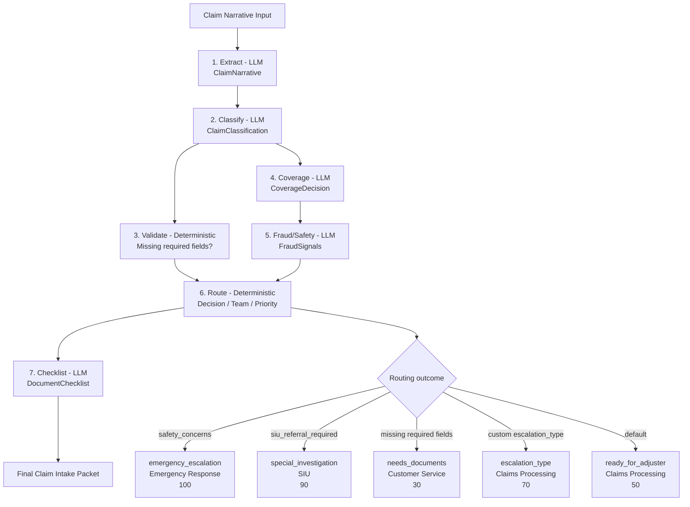
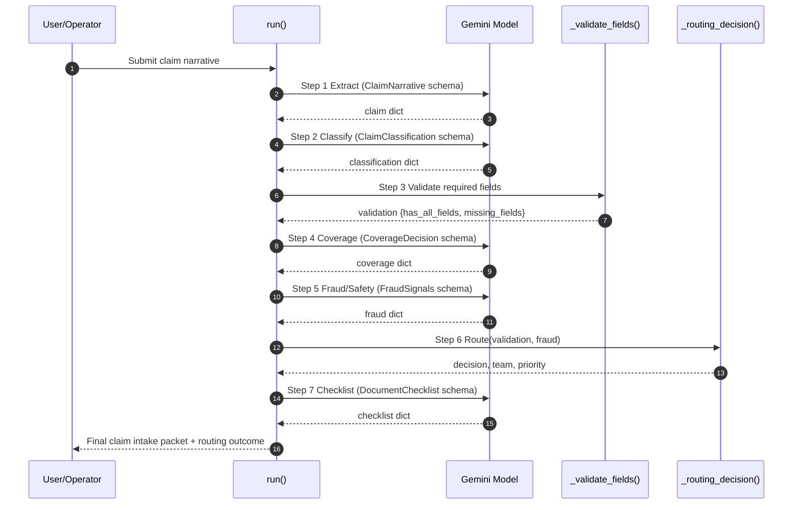

# Insurance Claims Intake Flow Spec

## Scope
Defines the end-to-end behavior of the insurance intake demo in `demos/insurance_claims.py`.

## Goal
Convert a free-text claim narrative into a structured intake packet with deterministic routing for human operations teams.

## Inputs
- `prompt` (optional): raw claim narrative text
- `model` (optional): Gemini model name (default `gemini-3-flash-preview`)
- `client`: configured `google.genai` client

## Outputs
- Console output for each step
- Final JSON-like intake packet containing:
  - extracted claim facts
  - claim classification
  - coverage decision
  - fraud/safety evaluation
  - deterministic routing decision (`decision`, `team`, `priority`)
  - document checklist

## Pipeline
1. **Extract** (LLM): narrative -> `ClaimNarrative`
2. **Classify** (LLM): type/severity/line -> `ClaimClassification`
3. **Validate** (deterministic): required field checks
4. **Coverage** (LLM): applicability + evidence + deductible
5. **Fraud/Safety** (LLM): fraud and escalation signals
6. **Route** (deterministic): decision/team/priority
7. **Checklist** (LLM): required and optional documents

All LLM steps require JSON responses via `response_mime_type="application/json"` and a schema from Pydantic `model_json_schema()`.

## Deterministic Rules

### Validation (`_validate_fields`)
Required fields:
- `policy_number`
- `incident_date`
- `incident_location`
- `incident_description`

Output:
- `has_all_fields: bool`
- `missing_fields: list[str]`

### Routing (`_routing_decision`)
Priority order:
1. If `safety_concerns=true` -> `emergency_escalation`, team `Emergency Response`, priority `100`
2. Else if `siu_referral_required=true` -> `special_investigation`, team `SIU`, priority `90`
3. Else if validation fails -> `needs_documents`, team `Customer Service`, priority `30`
4. Else if `escalation_type` exists and is not `ready_for_adjuster` -> that escalation, team `Claims Processing`, priority `70`
5. Else -> `ready_for_adjuster`, team `Claims Processing`, priority `50`

## Response Normalization
`_parse_response` must normalize model output to a plain dict in this order:
1. `response.parsed.model_dump()` if parsed is a Pydantic object
2. `response.parsed` if already a dict
3. `json.loads(response.text)` fallback
4. `{"raw": response.text}` if JSON parsing fails

## Mermaid Diagram

## Mermaid Sequence Diagram

## Test Coverage Expectations
From `tests/test_demos.py`:
- extraction fields are printed
- missing fields are detected and surfaced
- SIU routing path produces `special_investigation` and priority `90`
- final packet is printed and includes adjuster-ready messaging
- generation config includes JSON mime type and response schema
