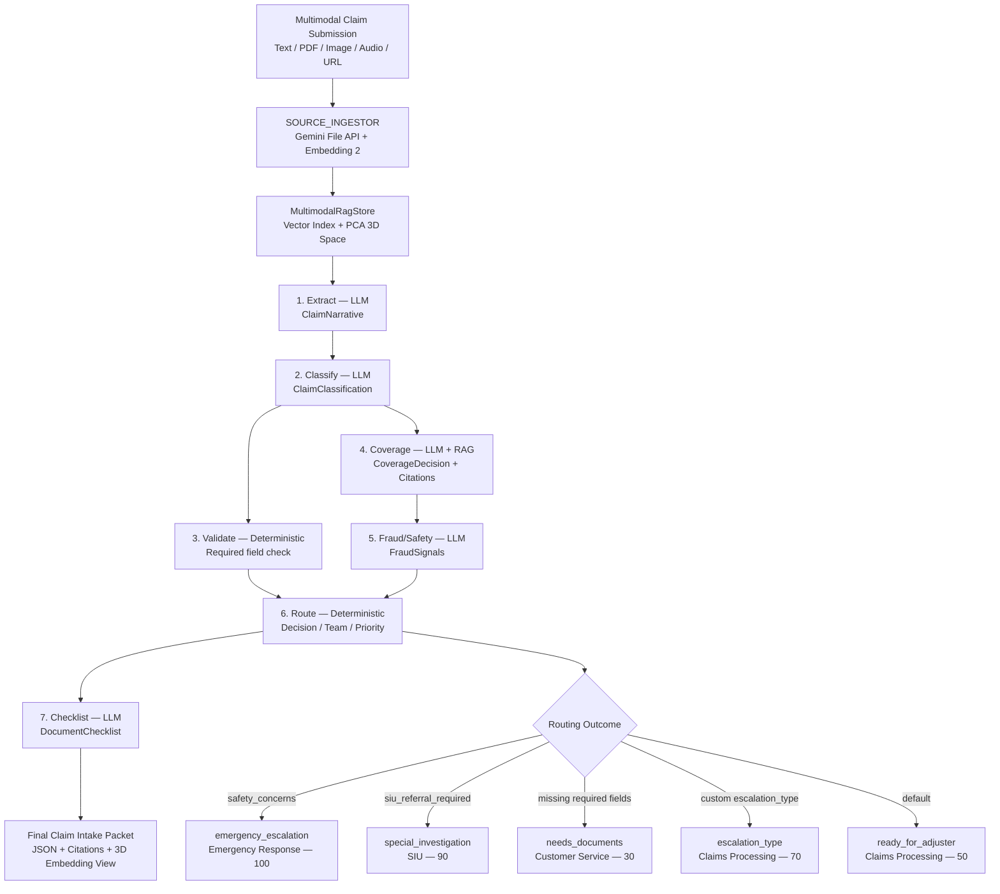
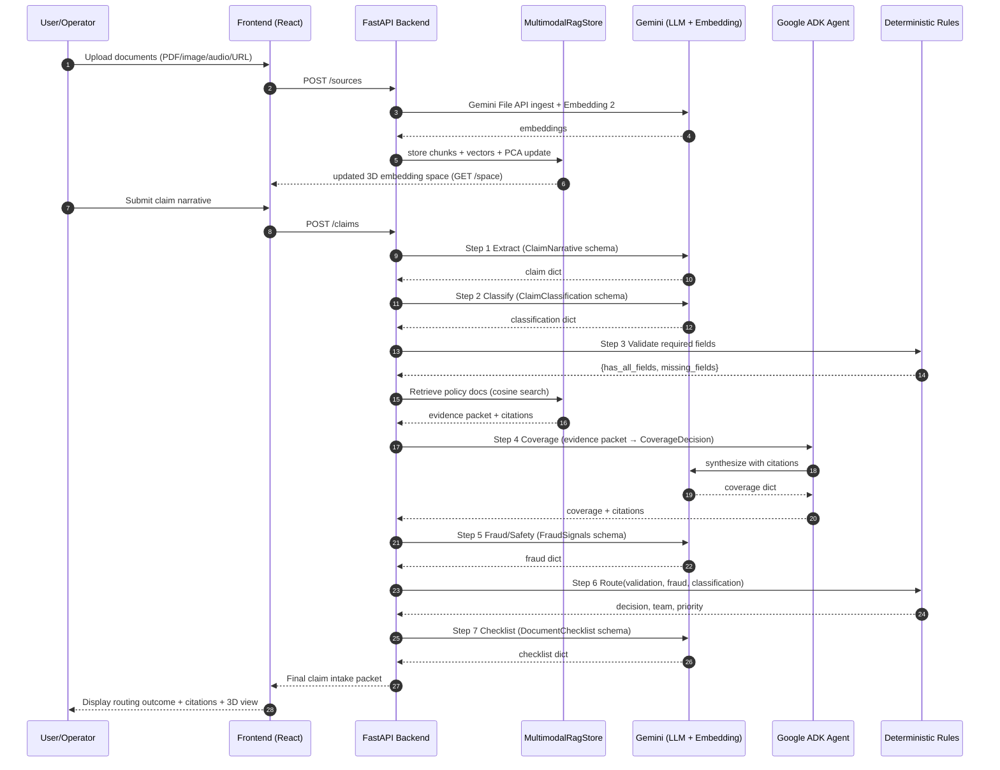

# Technical Spec: End-to-End Insurance Claims Workflow
## Multimodal Agentic Intake + Structured Routing Pipeline

---

## 1. Overview

This system ingests insurance claim submissions in any format (text, PDF, image, audio, video, URL), processes them through a structured multi-step AI pipeline, and produces a deterministic intake packet with a routed decision for human operations teams.

It combines two capabilities:
- **Multimodal Agentic RAG** — document ingestion, embedding, retrieval, and cited answer synthesis using Gemini Embedding 2 + Google ADK
- **Insurance Claims Pipeline** — structured LLM extraction, validation, fraud detection, coverage assessment, and deterministic routing

---

## 2. System Goals

| Goal | Description |
|---|---|
| Multimodal intake | Accept claim evidence in any format: PDFs, images, audio/video, URLs, raw text |
| Structured extraction | Convert free-text and document content into typed, validated claim records |
| Grounded decisions | All AI decisions are evidence-backed with traceable citations from ingested documents |
| Deterministic routing | Coverage and fraud signals feed deterministic rules for team assignment and priority |
| Interpretable retrieval | 3D PCA embedding visualization shows which documents drove each decision |
| Production-ready output | Final packet is JSON-serializable and consumable by downstream claims systems |

---

## 3. Architecture

```
┌─────────────────────────────────────────────────────────────────┐
│                        Submission Layer                         │
│  Text  │  PDF  │  Image  │  Audio/Video  │  URL  │  Form Data  │
└──────────────────────────┬──────────────────────────────────────┘
                           │
                           ▼
┌─────────────────────────────────────────────────────────────────┐
│               Multimodal Ingestion (ADK Agent)                  │
│  SOURCE_INGESTOR → Gemini File API → Gemini Embedding 2         │
│  MultimodalRagStore (in-memory or durable vector DB)            │
│  PCA projection (7,680D → 3D) for interpretability             │
└──────────────────────────┬──────────────────────────────────────┘
                           │
                           ▼
┌─────────────────────────────────────────────────────────────────┐
│               Claims Processing Pipeline (7 Steps)              │
│                                                                 │
│  1. Extract (LLM)      → ClaimNarrative                        │
│  2. Classify (LLM)     → ClaimClassification                   │
│  3. Validate (Det.)    → has_all_fields, missing_fields        │
│  4. Coverage (LLM)     → CoverageDecision                      │
│  5. Fraud/Safety (LLM) → FraudSignals                          │
│  6. Route (Det.)       → decision, team, priority              │
│  7. Checklist (LLM)    → DocumentChecklist                     │
└──────────────────────────┬──────────────────────────────────────┘
                           │
                           ▼
┌─────────────────────────────────────────────────────────────────┐
│                    Final Claim Intake Packet                     │
│  Structured JSON + routing outcome + document checklist         │
│  + embedding citations + 3D source visualization                │
└─────────────────────────────────────────────────────────────────┘
```

---

## 4. Component Inventory

### 4.1 Frontend

| Component | Technology | Responsibility |
|---|---|---|
| Source Manager | React + Vite | Upload/add documents, URLs, text |
| Q&A Panel | React | Submit claim narrative, view answers + citations |
| Embedding Space | Three.js (3D PCA) | Live visualization of documents in embedding space |
| Agent Trace Panel | React | Real-time ADK trace: SOURCE_INGESTOR → RETRIEVAL_TOOL → ANSWER_SYNTHESIZER |
| Routing Dashboard | React | Display final routing decision, team, priority |

### 4.2 Backend

| Component | Technology | Responsibility |
|---|---|---|
| API Server | FastAPI + Uvicorn | Endpoints: `/sources`, `/ask`, `/space`, `/claims` |
| RAG Store | MultimodalRagStore | Chunk storage, cosine similarity search, PCA projection |
| Embeddings | Gemini Embedding 2 | Multimodal embedding (text, image, audio, video, PDF) |
| ADK Agent | Google ADK | Orchestrates retrieval + answer synthesis from single evidence packet |
| Claims Pipeline | `demos/insurance_claims.py` | 7-step structured processing via `google.genai` |
| File Handling | Gemini File API | Temporary multimodal file ingestion (auto-cleaned) |

### 4.3 Infrastructure (Production)

| Component | Option | Notes |
|---|---|---|
| Vector DB | pgvector, Pinecone, Weaviate | Replace in-memory MultimodalRagStore |
| Compute | Cloud Run / Vertex AI Agent Engine | Backend deployment |
| Batch Embeddings | Vertex AI Batch Prediction | Scale embedding generation |
| Observability | LangSmith / Vertex AI Agent Engine tracing | Agent trace + citation audit |
| Eval | RAGAS-style harness | Citation accuracy measurement |

---

## 5. Data Models

### ClaimNarrative
```python
class ClaimNarrative(BaseModel):
    policy_number: str
    incident_date: str          # ISO 8601
    incident_location: str
    incident_description: str
    claimant_name: str | None
    contact_info: str | None
```

### ClaimClassification
```python
class ClaimClassification(BaseModel):
    claim_type: str             # e.g. "auto", "property", "liability", "health"
    severity: str               # e.g. "minor", "moderate", "major", "catastrophic"
    line_of_business: str
    escalation_type: str | None # e.g. "legal_hold", "large_loss", "ready_for_adjuster"
```

### CoverageDecision
```python
class CoverageDecision(BaseModel):
    is_covered: bool
    coverage_rationale: str
    supporting_evidence: list[str]   # citations from ingested policy docs
    deductible_applicable: float | None
    coverage_limit: float | None
```

### FraudSignals
```python
class FraudSignals(BaseModel):
    fraud_score: float           # 0.0 – 1.0
    fraud_indicators: list[str]
    siu_referral_required: bool
    safety_concerns: bool
    safety_description: str | None
```

### RoutingDecision
```python
class RoutingDecision(BaseModel):
    decision: str      # routing outcome key
    team: str          # assigned operations team
    priority: int      # 0–100
```

### DocumentChecklist
```python
class DocumentChecklist(BaseModel):
    required_documents: list[str]
    optional_documents: list[str]
    submission_deadline: str | None
```

---

## 6. Pipeline Detail

### Step 1 — Extract (LLM)
- **Input**: raw claim narrative (text extracted from any ingested source)
- **Prompt**: structured extraction against `ClaimNarrative.model_json_schema()`
- **Config**: `response_mime_type="application/json"`, response schema enforced
- **Output**: `ClaimNarrative` dict

### Step 2 — Classify (LLM)
- **Input**: `ClaimNarrative` dict
- **Prompt**: classify type, severity, line of business, initial escalation flag
- **Config**: same JSON enforcement
- **Output**: `ClaimClassification` dict

### Step 3 — Validate (Deterministic)
```python
def _validate_fields(claim: dict) -> dict:
    required = ["policy_number", "incident_date", "incident_location", "incident_description"]
    missing = [f for f in required if not claim.get(f)]
    return {"has_all_fields": len(missing) == 0, "missing_fields": missing}
```

### Step 4 — Coverage (LLM)
- **Input**: `ClaimNarrative` + `ClaimClassification` + **retrieved policy documents from RAG store**
- **Retrieval**: single `/ask`-style pass against ingested policy docs; same evidence packet used for answer and citations
- **Output**: `CoverageDecision` with `supporting_evidence` mapped to document citations

### Step 5 — Fraud/Safety (LLM)
- **Input**: full claim context so far
- **Output**: `FraudSignals`; `fraud_score`, `siu_referral_required`, `safety_concerns`

### Step 6 — Route (Deterministic)
```
Priority order:
  1. safety_concerns = true       → emergency_escalation  | Emergency Response | 100
  2. siu_referral_required = true → special_investigation  | SIU                |  90
  3. has_all_fields = false       → needs_documents        | Customer Service   |  30
  4. escalation_type exists
     and != ready_for_adjuster    → {escalation_type}      | Claims Processing  |  70
  5. default                      → ready_for_adjuster     | Claims Processing  |  50
```

### Step 7 — Checklist (LLM)
- **Input**: routing decision + classification + coverage
- **Output**: `DocumentChecklist` with required and optional document list

---

## 7. Response Normalization

All LLM step responses are normalized via `_parse_response()`:

```python
def _parse_response(response) -> dict:
    if hasattr(response, "parsed") and hasattr(response.parsed, "model_dump"):
        return response.parsed.model_dump()
    if isinstance(getattr(response, "parsed", None), dict):
        return response.parsed
    try:
        return json.loads(response.text)
    except json.JSONDecodeError:
        return {"raw": response.text}
```

---

## 8. API Endpoints

| Method | Path | Description |
|---|---|---|
| `POST` | `/sources` | Ingest a document, URL, or text into the RAG store |
| `GET` | `/space` | Return current embedding space (PCA-projected 3D coordinates + metadata) |
| `POST` | `/ask` | Run RAG retrieval + ADK agent synthesis; returns answer + citations |
| `POST` | `/claims` | Run full 7-step insurance pipeline on a submitted narrative |
| `GET` | `/health` | Health check; confirms Gemini Embedding 2 + ADK availability |

### `POST /claims` — Request
```json
{
  "prompt": "On April 12 my vehicle was rear-ended at the intersection of Main and 5th. Policy #AU-88271.",
  "model": "gemini-2.5-flash-preview-05-20",
  "include_embeddings": true
}
```

### `POST /claims` — Response
```json
{
  "claim": { ... },              // ClaimNarrative
  "classification": { ... },     // ClaimClassification
  "validation": { ... },         // has_all_fields, missing_fields
  "coverage": { ... },           // CoverageDecision with citations
  "fraud": { ... },              // FraudSignals
  "routing": {
    "decision": "ready_for_adjuster",
    "team": "Claims Processing",
    "priority": 50
  },
  "checklist": { ... },          // DocumentChecklist
  "citations": [ ... ],          // RAG source references used in coverage step
  "embedding_coordinates": [ ... ] // 3D PCA coords for visualization
}
```

---

## 9. Mermaid Flow Diagram



---

## 10. Sequence Diagram



---

## 11. Technology Stack

| Layer | Technology |
|---|---|
| LLM + Embeddings | `google-genai` (`gemini-2.5-flash-preview-05-20`, Gemini Embedding 2) |
| Agent Orchestration | Google ADK (`google-adk`) |
| API Framework | FastAPI + Uvicorn |
| Frontend | React + Vite + Three.js |
| Pydantic Schemas | Pydantic v2 (`model_json_schema()`, `model_dump()`) |
| Vector Storage | In-memory (dev) / pgvector or Pinecone (production) |
| Deployment | Cloud Run (backend), Vertex AI Agent Engine (agent tracing) |
| Observability | Vertex AI tracing / LangSmith |

> **SDK rule**: Always use `google-genai` (`from google import genai`). Never use `google-cloud-aiplatform`.

---

## 12. Environment Variables

| Variable | Required | Description |
|---|---|---|
| `GOOGLE_API_KEY` | Dev | Google AI Studio key (Gemini API direct mode) |
| `GEMINI_API_KEY` | Dev CLI | Used by `demo-gemini-python` (loaded from `.env`) |
| `GOOGLE_GENAI_USE_VERTEXAI` | Prod | Set `true` to use Vertex AI endpoint |
| `GOOGLE_CLOUD_PROJECT` | Prod | GCP project ID for Vertex AI |
| `GOOGLE_CLOUD_LOCATION` | Prod | Region (default: `global`) |
| `ALLOW_PRIVATE_URLS` | Optional | Allow localhost/private URLs for source ingestion |
| `PORT` | Cloud Run | Auto-set by Cloud Run (default: `8080`) |

---

## 13. Test Coverage Requirements

| Test Case | Expected Behavior |
|---|---|
| Extraction fields present | All `ClaimNarrative` fields are printed and non-null |
| Missing fields detected | `has_all_fields=false`, correct field names in `missing_fields` |
| SIU routing path | `siu_referral_required=true` → `special_investigation`, priority `90` |
| Emergency escalation | `safety_concerns=true` → `emergency_escalation`, team `Emergency Response`, priority `100` |
| Default routing | All flags false, fields complete → `ready_for_adjuster`, priority `50` |
| Final packet present | JSON packet printed, adjuster-ready messaging included |
| Generation config | All LLM steps include `response_mime_type="application/json"` and response schema |
| Citation accuracy | Coverage step citations are traceable to indexed source documents |
| RAG retrieval | Single retrieval pass per `/claims` call; same evidence packet used by ADK agent and UI |

---

## 14. Production Hardening Checklist

- [ ] Replace `MultimodalRagStore` in-memory store with pgvector or Pinecone + background ingestion jobs
- [ ] Add auth layer (API key or OAuth) on all endpoints
- [ ] Implement persistent claim storage (Firestore or Cloud SQL)
- [ ] Add RAGAS-style eval harness for citation recall and answer faithfulness
- [ ] Enable Vertex AI Agent Engine tracing for full ADK agent audit trail
- [ ] Scale embedding generation with Vertex AI Batch Prediction
- [ ] Rotate `GEMINI_API_KEY` committed in `demo-gemini-python/.env` (treat as compromised)
- [ ] Fix garbled `--region` value in `.claude/skills/products/cloud-run-basics/SKILL.md` line ~100
- [ ] Add structured logging to all pipeline steps (claim ID, step name, latency, token count)
- [ ] Set Cloud Run concurrency, min/max instances, and memory limits (`512Mi`, `1 cpu`, `60s timeout`)
