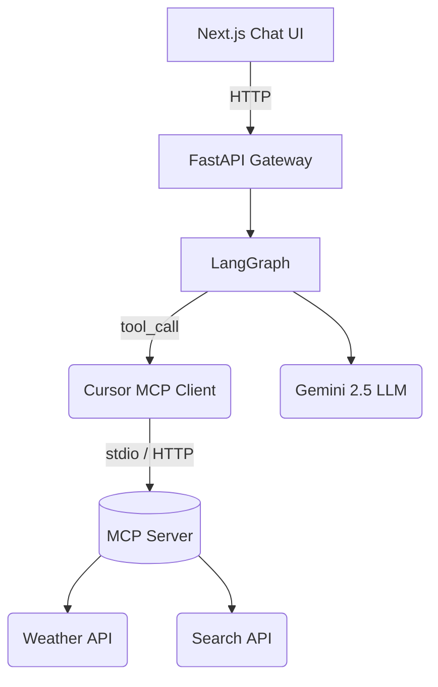

# 🚀 Building a Production‑Ready AI Agent with MCP, Cursor.ai, Gemini 2.5 & LangGraph

> **Audience:** AI/ML engineers who need a reproducible, open‑source path from _zero_ to a full‑stack, research‑augmented conversational agent.  
> **Stack:** **Cursor.ai** · **Model Context Protocol (MCP)** · **Google Gemini 2.5** · **LangGraph** · **Replit**  

---

## 📑 Table of Contents
1. [Why This Stack?](#why-this-stack)
2. [Prerequisites](#prerequisites)
3. [Part 0 — Connect Cursor to MCP](#part-0--connect-cursor-to-mcp)
4. [Part 1 — Local & Cloud Setup](#part-1--local--cloud-setup)
5. [Part 2 — Architecture Deep Dive](#part-2--architecture-deep-dive)
6. [Part 3 — Hands‑On Customisation](#part-3--hands-on-customisation)
7. [Part 4 — Test, Iterate & Deploy](#part-4--test-iterate--deploy)
8. [Troubleshooting](#troubleshooting)
9. [Credits](#credits)

---

## Why This Stack?
| Layer | Why it matters |
|-------|----------------|
| **MCP** | Open protocol for connecting LLMs to external data/tools without bespoke adapters. |
| **Cursor IDE** | AI‑native code editor with one‑click MCP integration, inline edits, chat‑with‑code. |
| **Gemini 2.5** | Google’s latest multimodal LLM (128 k+ context, strong reasoning, code understanding). |
| **LangGraph** | Declarative state‑machine library for multi‑actor LLM workflows. |
| **Replit** | Zero‑friction cloud IDE with CI/CD deploy & live URLs. |

> *2023 GitHub Octoverse reported a **40 %** surge in open‑source AI projects, while Replit case studies show prototypes built **3×** faster with AI‑assisted coding.*

---

## Prerequisites
| Tool | Min Version | Notes |
|------|-------------|-------|
| **Cursor** | `v0.48+` | <https://cursor.com> |
| **Python** | `3.10+` | Poetry/uv recommended |
| **Google AI key** | Gemini 2.5 Pro | <https://ai.google.dev> |
| **Replit** account | Free tier OK | “Run on Replit” supported |
| **MCP Python SDK** | `>=0.3` | `pip install mcp` |

---

## Part 0 — Connect Cursor to MCP
### 0.1 GUI install
1. Open **Cursor → Settings → MCP**.  
2. Browse available tools & click **Install**.  
3. OAuth if prompted—the tool will appear under *Available Tools*.

### 0.2 Manual `.cursor/mcp.json`
```jsonc
{
  "mcpServers": {
    "local-weather": {
      "command": "python",
      "args": ["weather_server.py"],
      "env": { "OPEN_METEO_URL": "https://api.open-meteo.com" }
    }
  }
}
```
Cursor autostarts each server and exposes its declared tools to the built‑in agent.

### 0.3 Transport Options

| Transport | Runs Where | Use‑case |
|-----------|-----------|----------|
| **stdio** | Local process | Fast prototyping |
| **SSE** | Local/remote HTTP | Multi‑user teams |
| **Streamable HTTP** | Remote micro‑tools | High‑latency tolerant |

---

## Part 1 — Local & Cloud Setup
### 1.1 Configure Gemini 2.5 in Cursor
* `⌘/Ctrl +,` → **Models → Add Custom**  
* Paste `GOOGLE_API_KEY`, verify → choose **`gemini‑2.5‑pro`** as default.

### 1.2 Fork Google’s Full‑Stack Agent on Replit
```bash
replit push https://github.com/google/full-stack-agent
```
Add secrets:
```env
GOOGLE_API_KEY=...
OPEN_METEO_URL=https://api.open-meteo.com
```

### 1.3 Install Deps & Example MCP Server
```bash
pip install mcp fastapi uvicorn langgraph google-generativeai python-dotenv
git submodule add https://github.com/modelcontextprotocol/python-sdk mcp_sdk
cp mcp_sdk/examples/weather_server.py .
```

---

## Part 2 — Architecture Deep Dive


* **UI**: React/Next chat streams via SSE.  
* **LangGraph**: Nodes = tools; edges = control‑flow loops.  
* **Cursor MCP Client**: Handles schema validation, auth, retries.  

---

## Part 3 — Hands‑On Customisation
### 3.1 “Hello‑World” Persona Tweak
1. Open `backend/graph.py` in Cursor.  
2. Ask Chat: *“find system prompt”*.  
3. Replace the default prompt with:  

```python
"You are **Chronos**, a witty historian who cites primary sources."
```

### 3.2 Add Research‑Augmented Generation (RAG)
*Improve query diversity*:
```python
def build_queries(q: str) -> list[str]:
    base = q.lower()
    return [
        f"{base} primary source",
        f"academic review of {base}",
        f"latest news on {base}"
    ]
```
*Return citations* by attaching a `sources` list and formatting footnotes in Gemini’s final prompt.

### 3.3 Create a Weather MCP Tool
`weather_server.py`
```python
from mcp.server.fastmcp import FastMCP
import httpx, os, geopy

mcp = FastMCP("Weather Server")

@mcp.tool(description="Get current temperature")
async def weather_now(city: str) -> str:
    lat, lon = geopy.geocoders.Nominatim(user_agent="weather").geocode(city)[1]
    r = httpx.get(os.getenv("OPEN_METEO_URL"), params={
        "latitude": lat, "longitude": lon, "hourly": "temperature_2m"})
    temp = r.json()["hourly"]["temperature_2m"][0]
    return f"{temp} °C right now in {city}"

if __name__ == "__main__":
    mcp.run_stdio()
```
Declare it in `.cursor/mcp.json` (see **0.2**). Cursor will auto‑discover **`weather_now`**.

---

## Part 4 — Test, Iterate & Deploy
```bash
python weather_server.py &   # start MCP tool
uvicorn backend.api:app --reload
```
1. Open Replit preview.  
2. Ask: “What’s the weather in Tokyo and cite two primary sources on its climate record?”  
3. Iterate edits in Cursor → hot reload triggers on Replit.  
4. Press **Replit → Deploy** for a public URL.

---

## Troubleshooting
| Symptom | Fix |
|---------|-----|
| `401 Unauthorized` from Gemini | Check billing & `GOOGLE_API_KEY`. |
| `ModuleNotFoundError: mcp` | `pip install mcp` and verify venv. |
| Cursor lists only 40 tools | Reduce active servers or disable unused tools. |
| Tools invisible in remote SSH | Prefer SSE/HTTP transports or run Cursor locally. |

---

## Credits
1. Model Context Protocol spec — <https://modelcontextprotocol.io>  
2. Cursor MCP docs — <https://docs.cursor.com/context/model-context-protocol>  
3. Google DeepMind Gemini 2.5 — <https://blog.google/technology/google-deepmind/gemini-model-thinking-updates-march-2025/>  
4. LangGraph overview — <https://www.langchain.com/langgraph>  
5. GitHub Octoverse 2023 — <https://github.blog/news-insights/research/the-state-of-open-source-and-ai/>  
6. Replit AI case study — <https://freshvanroot.com/blog/review-replit-ai-app-prototyping/>  
7. Anthropic MCP announcement — <https://www.anthropic.com/news/model-context-protocol>  
