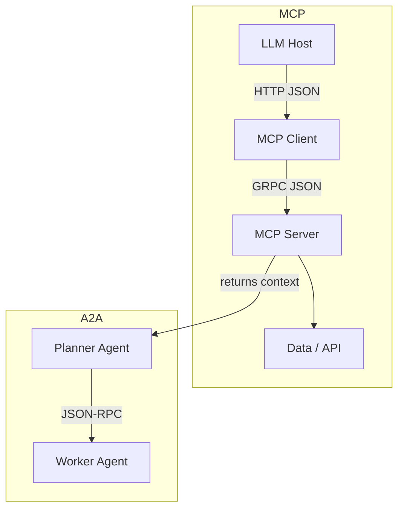

# MCP vs A2A: Hands‑On Tutorial for AI Engineers


---
## 1 . Overview
**Model Context Protocol (MCP)** standardises *data/context access* for a single agent or LLM.  
**Agent‑to‑Agent (A2A)** standardises *communication & task delegation* **between** agents.  
They are *complementary* – think **USB‑C (MCP) + Ethernet (A2A)** for your agent stack.


---
## 2 . When to use which?
| Need | Use | Why |
|------|-----|-----|
| Access GitHub, Slack, SQL from one agent | **MCP** | Simplifies M×N integrations |
| Delegate “file a Jira ticket” to another agent | **A2A** | JSON‑RPC handshake with opaque internal state |
| Combine: Planner agent finds bug (MCP) ➔ Worker agent fixes it (A2A) | **Both** | Best of context + collaboration |

---
## 3 . Prerequisites
* Python ≥ 3.9  
* `uv` (or `pip`) package manager  
* Two terminal windows  
* An OpenAI/Anthropic key (for demo LLM calls)  
* Linux/macOS/WSL2 (Win PowerShell also works)

```bash
# Install uv once (fast Python package manager)
pip install uv
```

---
## 4 . Quick‑start Matrix

| Part | Folder | What you’ll build |
|------|--------|-------------------|
| 4A   | `mcp-demo/` | Minimal MCP Server exposing a SQLite DB of flights |
| 4B   | `a2a-demo/helloworld/` | HelloWorld A2A Agent & client |
| 4C   | `planner‑worker/` | Planner agent (A2A) ⬌ Worker agent (A2A + MCP) |

Clone the code skeleton (includes all three folders):

```bash
git clone https://github.com/example/mcp-vs-a2a-tutorial.git
cd mcp-vs-a2a-tutorial
```

---
## 5 . Part A – Build & Test MCP
### 5.1  Create virtual env & install SDK

```bash
cd mcp-demo
uv venv .venv && source .venv/bin/activate
uv pip install mcp fastapi uvicorn sqlite-utils
```

### 5.2  Write `server.py`

```python
# mcp-demo/server.py
from fastapi import FastAPI
from mcp.server import MCPServer, Function, param, returns
import sqlite3, json

DB = "flights.db"

def query_db(sql: str):
    with sqlite3.connect(DB) as conn:
        cur = conn.execute(sql)
        cols = [c[0] for c in cur.description]
        return [dict(zip(cols, row)) for row in cur.fetchall()]

app = FastAPI()
mcp = MCPServer(app, title="Flight MCP Server")

@mcp.capability(namespace="flights")
class Flights:
    @Function
    @param("origin", str)
    @param("dest", str)
    @returns("results", list)
    def search(origin: str, dest: str):
        sql = f"SELECT * FROM flights WHERE origin='{origin}' AND dest='{dest}'"
        return query_db(sql)
```

### 5.3  Run server & seed DB

```bash
python seed_db.py          # creates flights.db with sample routes
uvicorn server:app --host 0.0.0.0 --port 3333
```

### 5.4  Query with an MCP client

```python
# mcp-demo/test_client.py
from mcp import Client
client = Client("http://localhost:3333")
res = client.flights.search(origin="SFO", dest="NRT")
print(res)
```

Expected output:

```json
[{"flight_no": "GA101", "price": 780, "depart": "2025‑07‑15T10:00"}]
```

---
## 6 . Part B – Build & Test A2A
### 6.1  Set up env & install SDK

```bash
cd ../a2a-demo/helloworld
uv venv .venv && source .venv/bin/activate
uv pip install a2a-sdk fastapi uvicorn
```

### 6.2  Create `agent_executor.py`

```python
# a2a-demo/helloworld/agent_executor.py
from a2a import AgentExecutor, expose
class HelloAgent(AgentExecutor):
    @expose
    def greet(self, name: str) -> str:
        return f"Hello {name}! 👋"
```

### 6.3  Create & publish Agent Card

```jsonc
// a2a-demo/helloworld/agent-card.json
{
  "$schema": "https://google-a2a.github.io/schemas/agent-card.schema.json",
  "id": "urn:agent:hello‑world‑123",
  "name": "HelloAgent",
  "description": "Returns friendly greetings",
  "endpoint": "http://localhost:4242/rpc"
}
```

### 6.4  Launch agent

```bash
python -m a2a_sdk.run agent_executor:HelloAgent --card agent-card.json
```

### 6.5  Call agent (client)

```python
# a2a-demo/helloworld/test_client.py
from a2a import A2AClient
client = A2AClient("http://localhost:4242/rpc")
print(client.call("greet", name="Ada"))
```

Output ➔ `Hello Ada! 👋`

---
## 7 . Part C – Planner + Worker (MCP × A2A)

*Planner* delegates data work to *Worker*.

1. **Worker agent** imports `mcp-demo` as library and exposes `search_flights()` via A2A.  
2. **Planner agent** receives human query ➔ calls Worker via `client.call("search_flights", ...)` ➔ summarises.

<details>
<summary>Worker skeleton</summary>

```python
class Worker(AgentExecutor):
    def __init__(self):
        from mcp import Client
        self.mcp = Client("http://localhost:3333")
    @expose
    def search_flights(self, origin:str, dest:str):
        return self.mcp.flights.search(origin=origin, dest=dest)
```
</details>

Run both agents:

```bash
# in one terminal
python -m a2a_sdk.run worker:Worker --card worker-card.json --port 5001

# in another
python -m a2a_sdk.run planner:Planner --card planner-card.json --port 5002
```

Ask Planner:

```
> find me flights SFO → NRT under $900
```

Planner ➔ Worker ➔ MCP ➔ Worker ➔ Planner ➔ LLM answer.

---
## 8 . Architectural Cheat‑Sheet



---
## 9 . Cleaning Up

```bash
pkill -f uvicorn
deactivate
rm -rf mcp-demo/.venv a2a-demo/helloworld/.venv
```

---
## 10 . Further Reading
* **MCP docs:** <https://modelcontextprotocol.io/introduction>  
* **A2A spec:** <https://github.com/google-a2a/A2A>  
* Official Python SDK samples: <https://github.com/google-a2a/a2a-samples>  
* Deep‑dive blog on MCP: <https://medium.com/@nimritakoul01/the-model-context-protocol-mcp-a-complete-tutorial-a3abe8a7f4ef>  
* A2A HelloWorld walk‑through: <https://medium.com/google-cloud/getting-started-with-google-a2a-a-hands-on-tutorial-for-the-agent2agent-protocol-3d3b5e055127>  

---
**Happy hacking!**  
Contribute fixes & examples ➔ PRs welcome 🙌
